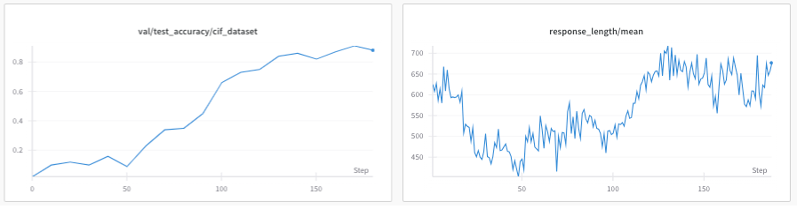
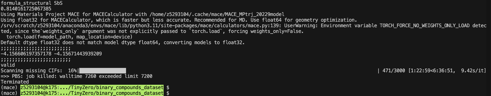

Crystal Relaxing
===================

.. currentmodule:: open_r1.tasks.relaxing

BinaryCompoundRelaxing
------------------

.. autoclass:: BinaryCompoundRelaxing
   :members:
   :show-inheritance:

Task Description
----------------

The `BinaryCompoundRelaxing` task guides a language model through multiple steps of structural relaxation on perturbed binary compounds. Given a serialized CIF description of a compound, the model must iteratively propose adjustments to reduce the internal energy, documenting its reasoning within <think> tags and outputting a final relaxed structure within <answer> tags.

Features
--------

- Uses an m2s-style serialized CIF representation as the task input and expected output format
- Prompts the model to provide crystallographic reasoning inside ``<think>`` tags and the final relaxed structure inside ``<answer>`` tags
- Evaluates predictions with structure deserialization, CIF validity checks, and an energy-based reward computed from the generated and reference structures

Usage Example
-------------

.. code-block:: python

    from open_r1.tasks.crystal_structure.relaxing import BinaryCompoundRelaxing

    # Initialize the task, pointing to a local dataset directory
    task = BinaryCompoundRelaxing(dataset_id_or_path="/path/to/cif_data")

    # Load datasets
    dataset = task.load()
    train_ds = dataset["train"]
    test_ds  = dataset["test"]

    # Compute accuracy rewards for an example prediction
    completions = ["<think>…</think><answer>M2S serialized_cif …</answer>"]
    solutions   = ["M2S serialized_cif …"]
    rewards = task.accuracy_reward(completions, solutions)

Data Format
-----------

The task reads paired text files with multi-line CIF records separated by blank lines:

- `src-train.txt / src-test.txt`: Each record is a serialized CIF string of a perturbed binary structure.
- `tgt-train.txt / tgt-test.txt`: Each record is the ground‑truth CIF string after DFT relaxation.

Task
----------------
Generate a structure with lower internal energy.

Base model
----------------
`Qwen/Qwen2.5-3B-Instruct`, fine-tuned on the MPtraj dataset via supervised fine-tuning (SFT).

Reward Functions
----------------

1. **Accuracy Reward (accuracy_reward)**
   - Reward is assigned based on the validity of the generated CIF structure and its internal energy relative to the input:
     - **–10**: if the generated structure (`S_gen`) is **not a valid CIF format**.
     - **–4**: if `S_gen` is a **valid CIF format** but has **higher or equal internal energy** than the input.
     - **+1**: if `S_gen` is **valid** and has **lower internal energy** than the input.

Task Example
------------

.. code-block:: text

   Input:  unstable Crystal structure [M2S format]
   Output: relaxed Crystal structure [M2S format]

Around step 50, the model experiences a pivotal shift (the “aha moment”) where it transitions from moderate performance gains to a pronounced acceleration in accuracy. By the final stages of training, the model achieves a 91% success rate in generating lower-energy structures, underscoring the effectiveness of the learning process after redesigning the experiments.
We selected the checkpoint at step 130 for evaluation on a larger, external test set. Among 471 binary crystal structures, the model achieved a success rate of 81% in generating structures with lower internal energy.

Motivation
----------------
Crystal Structure Relaxation usually serves as the fundamental initial step in material science, establishing the foundation for the development of real-world applications. Traditional Crystal Structure Relaxation Algorithms are computationally expensive and scale poorly with system size, due to the intensive computational demands of their iterative procedures. To accelerate this process, we propose to introduce a large language model (LLM) trained via Group Relative Policy Optimisation (GRPO), which is designed to rapidly reduce the crystal’s internal energy and converge toward a DFT-relaxed configuration. By pre-relaxing structures, the DFT method can complete the residual relaxation steps in fewer iterations, significantly reducing the time required for the relaxation process, especially for complex structures. Our model is initially supervised fine-tuned (SFT) on the Materials Project Trajectory dataset, comprising multiple intermediate relaxation frames, and subsequently optimised with GRPO reinforcement learning on perturbed structures.  Evaluation on a binary compound validation set shows a 91% success rate, defined as generating structures with lower internal energy than their inputs. These results validate the effectiveness of our current approach and suggest feasibility for further scaling to more complex material systems.
