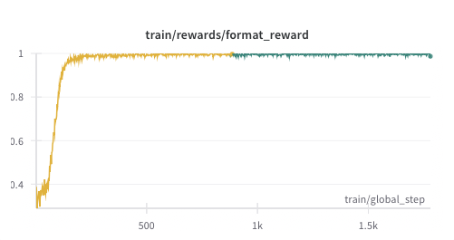
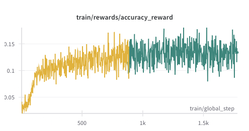
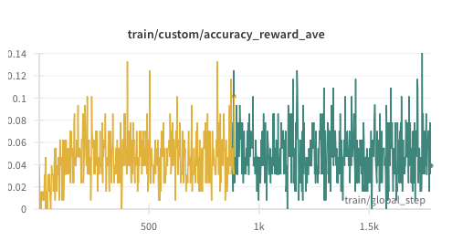
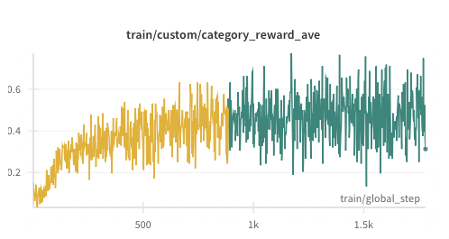
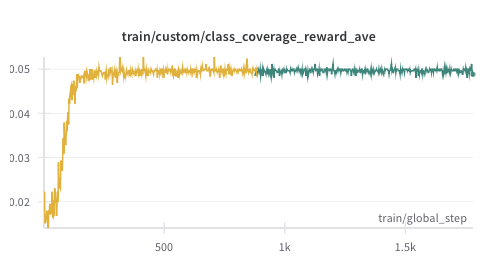

Kinetic Reaction Classification
=========================

.. currentmodule:: open_r1.tasks.kinetic_data

KineticDataClassification
----------------------

.. autoclass:: KineticDataClassificationWithMetrics
   :members:
   :show-inheritance:

Task Description
-----------------

This task is the same as the KineticDataClassification task, but it calculates some metrics, and provide it in the prompt so that the reasoning process is shorter and less complicated.
The Kinetic Reaction Classification task is designed to identify and classify chemical reaction mechanisms from kinetic data. The task presents experimental data from multiple runs with different initial conditions and requires the model to determine which of the 20 possible reaction mechanisms (M1-M20) best explains the observed behavior.

Features
-------

- Supports classification of 20 different reaction mechanisms (M1-M20)

- Processes normalized kinetic data from multiple experimental runs

- Handles substrate, product, and catalyst concentration data

- Provides detailed reasoning process for mechanism classification

Usage Example
--------------

.. code-block:: python

    from open_r1.tasks.kinetic_data import KineticDataClassificationWithMetrics

    # Initialize the task
    task = KineticDataClassificationWithMetrics(
        dataset_id_or_path="path/to/kinetic/data",
    )

    # Load the dataset
    dataset = task.load()

    # Example of reward calculation
    completions = ["<think>Detailed reasoning...</think>\\boxed{M1}"]
    solution = ["M1"]
    rewards = task.accuracy_reward(completions, solution)

Data Format
-------------

The task expects data files in the following format:

- ``path/to/kinetic/data/x_train/x1_train_M1_M20_train_val_test_set_part_0.pkl``: Training data for initial catalyst concentrations

- ``path/to/kinetic/data/x_train/x2_train_M1_M20_train_val_test_set_part_0.pkl``: Training data for time series measurements

- ``path/to/kinetic/data/y_train/y_train_M1_M20_train_val_test_set.pkl``: Training labels (mechanism classes)

- ``path/to/kinetic/data/x_val/x1_val_M1_M20_train_val_test_set.pkl``: Validation data for initial catalyst concentrations

- ``path/to/kinetic/data/x_val/x2_val_M1_M20_train_val_test_set.pkl``: Validation data for time series measurements

- ``path/to/kinetic/data/y_val/y_val_M1_M20_train_val_test_set.pkl``: Validation labels (mechanism classes)

Reward Functions
-----------------
The accuracy reward is calculated by the weighted sum of the following rewards.

1. **Exact Match (accuracy_reward)**
   
   Calculates binary rewards based on exact mechanism classification:
   
   - Correct mechanism classification: 1.0
   
   - Incorrect mechanism classification: 0.0

2. **Class Coverage Reward (accuracy_reward)**

   Calculates the reward based on the percentage of the 20 reaction classes that the model considered during the reasoning.
   
   - If the model considered all 20 reaction classes, the reward is 1.0.

3. **Data Coverage Reward (accuracy_reward)**

   Calculates the reward based on the percentage of the 4 data runs that the model considered during the reasoning.

   - If the model considered all 4 data runs, the reward is 1.0.

4. **Category Match (accuracy_reward)**

   Calculates the reward based on the answer that the model gave is in the same category as the ground truth.
   
   - If the model gave the answer that is in the same category as the ground truth, the reward is 1.0.
  
   - For example, if the ground truth is M3, and the model gave M2, the reward is 1.0.
   
   - Category is defined as follows:
      
      - M1: Core mechanism
      
      - M2-M5: Bicatalytic steps
      
      - M6-M8: Activation steps
      
      - M9-M20: Deactivation steps

The format reward is calculated by the following reward.
1. **Format Reward (format_reward)**

   Calculates the reward based on the format of the answer.
   - If the answer includes ``<think>`` and ``\\boxed{}``, the reward is 1.0.
  
   - Otherwise, the reward is 0.0.

   **Note:**
   - This format is intended to train DeepSeek R1 Distill Qwen.

   - There is the suggestion to use the format in the prompt in their transformer website. I once tried to use ``<think>`` and ``<answer>``, but the format reward did not start to increase in the first 50 global steps.

Task Example
--------------

.. code-block:: text

   Input: 
   # Data Run 1
   - Initial concentration of catalyst: 0.1
   - Initial concentration of substrate: 1.0
   - Time series data: [0, 1, 2, 3]
   - Substrate data: [1.0, 0.8, 0.6, 0.4]
   - Product data: [0.0, 0.2, 0.4, 0.6]
   
   Output: M1
   Reasoning: <think>
   The reaction shows first-order kinetics with respect to substrate...
   The mechanism must involve a single catalytic site...
   Therefore, M1 is the most likely mechanism.
   </think>
   \\boxed{M1}

Reward Functions
------------------
The accuracy reward is calculated by the weighted sum of the following rewards. The weights are set to 0.5, 0.2, 0.2 and 0.1 for exact match, class coverage reward, data coverage reward and category match respectively.

1. **Exact Match (accuracy_reward)**
   
   Calculates binary rewards based on exact mechanism classification:
   
   - Correct mechanism classification: 1.0
   
   - Incorrect mechanism classification: 0.0

2. **Class Coverage Reward (accuracy_reward)**

   Calculates the reward based on the percentage of the 20 reaction classes that the model considered during the reasoning.
   
   - If the model considered all 20 reaction classes, the reward is 1.0.

3. **Data Coverage Reward (accuracy_reward)**

   Calculates the reward based on the percentage of the 4 data runs that the model considered during the reasoning.
   
   - If the model considered all 4 data runs, the reward is 1.0.

4. **Category Match (accuracy_reward)**

   Calculates the reward based on the answer that the model gave is in the same category as the ground truth.
   
   - If the model gave the answer that is in the same category as the ground truth, the reward is 1.0.
   
   - For example, if the ground truth is M3, and the model gave M2, the reward is 1.0.
   
   - Category is defined as follows:
      - M1: Core mechanism
  
      - M2-M5: Bicatalytic steps
  
      - M6-M8: Activation steps
  
      - M9-M20: Deactivation steps

The format reward is calculated by the following reward.

1. **Format Reward (format_reward)**

   Calculates the reward based on the format of the answer.
   
   - If the answer includes ``<think>`` and ``\\boxed{}``, the reward is 1.0.
   
   - Otherwise, the reward is 0.0.

   **Note:**
   
   - This format is intended to train DeepSeek R1 Distill Qwen.
   
   - There is the suggestion to use the format in the prompt in their transformer website. I once tried to use ``<think>`` and ``<answer>``, but the format reward did not start to increase in the first 50 global steps.

Task Example
--------------

.. code-block:: text

   Input: 
   # Data Run 1
   - Initial concentration of catalyst: 0.1
   - Initial concentration of substrate: 1.0
   - Time series data: [0, 1, 2, 3]
   - Substrate data: [1.0, 0.8, 0.6, 0.4]
   - Product data: [0.0, 0.2, 0.4, 0.6]
   
   Output: M1
   Reasoning: <think>
   The reaction shows first-order kinetics with respect to substrate...
   The mechanism must involve a single catalytic site...
   Therefore, M1 is the most likely mechanism.
   </think>
   \\boxed{M1}

Experimental Method Details
-----------------------------

Base Model Used
^^^^^^^^^^^^^^^^^^
DeepSeek R1 Distill Qwen 1.5B

Job ID and the Run Name on WanDB
^^^^^^^^^^^^^^^^^^^^^^^^^^^^^^^^^^
- Job ID: 
  
  - 436558
  
  - 438902
  
- Run Name: 
  
  - grpo-436856-from_436856-DeepSeek-R1-Distill-Qwen-1.5B
  
  - grpo-438902-from_436856-DeepSeek-R1-Distill-Qwen-1.5B

Training Details
^^^^^^^^^^^^^^^^^^
- The base model was trained directly using GRPO without supervised fine-tuning.
  
- Training was conducted for 1775 global steps.

Datasets used for RL
^^^^^^^^^^^^^^^^^^^^^^^^
Datasets used in this task is based on the study "Organic reaction mechanism classification using machine learning".
Larrosa, Igor (2022). Training, validation and test set for M1-M20. University of Manchester. Dataset. https://doi.org/10.48420/16965292.v2

It originally contains 5,000,000 samples of kinetic profiles for reaction mechanisms transforming a substrate S into a product P, catalyzed by a catalyst, cat, and 1000 sample of 500000 samples were used for GRPO.
Each profile was generated by solving the corresponding ordinary differential equations corresponding to 20 typical mechanisms.

These mechanisms belong to four distinct categories: 

1) the core mechanism (M1), is the simplest Michaelis-Menten-type mechanism; 

2) mechanisms with bicatalytic steps (M2-M5), involve either catalyst dimerization (M2 and M3), or a reaction between two different catalytic species (M4 and M5); 
   
3) mechanisms with catalyst activation steps based on the core mechanism, where a precatalyst requires activation unimolecularly (M6), via substrate coordination (M7) or via ligand dissociation (M8); 
   
4) mechanisms with a variety of catalyst deactivation steps from either catalytic intermediate of the core mechanism (M9-M20). 

For each samples, the dataset contains four data runs, and each data run contains:

- The initial concentration of the catalyst: 1-dimentional, normalized.

- Time series data: 21 dimentional. The values are normalized to 0-1.

- Substrate data: 21 dimentional, normalized relative to the intial substrate concentration.

- Product data: 21 dimentional, normalized relative to the intial substrate concentration.

- The mechanism class: One of M1-M20.

The dataset is incorporated into the prompt as follows.

Prompt
^^^^^^^^^
I included each reaction mechanisms explanation and the metrics that were calculated in advance in the prompt as follows.

Metrics Used in the Task
"""""""""""""""""""""""""""""""""""

Reaction Order
~~~~~~~~~~~~~~~~~~~~~~~~~~~~~~~~~~~~~
Indicates how the reaction rate depends on reactant concentration. Values > 1 suggest nonlinear behavior.
This metrics are calculated by comparing substrate vs time, ln(substrate) vs time and 1/substrate vs time, which are the best fit with linear regression.
If substrate vs time is the best fit, the reaction order is 0. If ln(substrate) vs time is the best fit, the reaction order is 1. If 1/substrate vs time is the best fit, the reaction order is 2.

Turnover frequency (TOF)
~~~~~~~~~~~~~~~~~~~~~~~~~~~~~~~~~~~~~
Is how many product molecules are formed per catalyst site per second.
This metrics are calculated by the initial slope of the product vs time using first three data points.

Turnover number (TON)
~~~~~~~~~~~~~~~~~~~~~~~~~~~~~~~~~~~~~
Indicates how many times a single catalyst can act before deactivating. 
TON is calculated by dividing the total amount of product formed by the initial concentration of catalyst.

Catalyst stability
~~~~~~~~~~~~~~~~~~~~~~~~~~~~~~~~~~~~~
Indicates how stable the catalyt is. If a value is near 1, it means that the catalyst is stable. Much less than 1 means that the catalyst is unstable.
This metrics is calculated by the final rate devided by the initial rate. The final rate and the initial rate are calculated by last and first two data points.

Induction period
~~~~~~~~~~~~~~~~~~~~~~~~~~~~~~~~~~~~~
Indicates the time before the reaction rate becomes significant. A long period may suggest catalyst activation delays.
This metrics is calculated by detecting the first time point where product exceeds 5% of total growth.

Mass balance gap
~~~~~~~~~~~~~~~~~~~~~~~~~~~~~~~~~~~~~
Indicates how much mass is "missing" from expected total. High gaps may imply side reactions or deativation.
This is calculated by comparing the substrate loss to product gain, and returning the absolute value of the difference.

Deactivation rate constant
~~~~~~~~~~~~~~~~~~~~~~~~~~~~~~~~~~~~~
Indicates the rate of catalyst deactivation. Higher value mans faster deactivation. 
This metrics is calculated by the negative slope by fitting ln(reaction rate) vs time. Reaction rate is time-derivatives of product.

Time of maximum curvature
~~~~~~~~~~~~~~~~~~~~~~~~~~~~~~~~~~~~~
Time at which the rate of change in conversion is highest. Indicates key kinetic transitions.
This is calculated by detecting the time when the second derivative of product vs time is maximum.

Active catalyst fraction
~~~~~~~~~~~~~~~~~~~~~~~~~~~~~~~~~~~~~
Proportion of catalyst that remains active during the reaction. 1.0 means fully active.
This is calculated by the final reaction rate devided by the initial reaction rate.

Catalyst activity half-life
~~~~~~~~~~~~~~~~~~~~~~~~~~~~~~~~~~~~~
Time until catalyst activity falls to half. Longer means more durable catalyst.
This is calculated by detecting the time when the reaction rate is half of the initial rate.

Equilibrium constant (Keq)
~~~~~~~~~~~~~~~~~~~~~~~~~~~~~~~~~~~~~
Ratio of product to reactant at equilibrium. Higher values indicate more favorable product formation.
This is calculated by the ratio of product to substrate at the end of the reaction.

SP_mid_ratio
~~~~~~~~~~~~~~~~~~~~~~~~~~~~~~~~~~~~~
Ratio of substrate to product at midpoint of the reaction. Useful for understanding reaction progress.
This is calculated by the ratio of substrate to product at midpoint of the reaction.

Mass gap at midpoint
~~~~~~~~~~~~~~~~~~~~~~~~~~~~~~~~~~~~~
Mass balance gap measured at the halfway point of the reaction. Can signal mid-reaction instabilities.

  
.. code-block:: text
      
   Reason and estimate the reaction class for the following reaction.
   The possible reaction classes are M1 to M20 indicated as follows.
   Please begin your response with "<think>", then provide a detailed, step-by-step reasoning process (including any intermediate reflections or re-evaluations), 
   then end with </think>, and finally put your final answer within \\boxed{{}} tags, for example \\boxed{{M1}}.

   # Possible reaction classes
   // M1 Mechanism
   S+cat<=>catS;k1,k-1|catS<=>P+cat;k2,k-2

   // M2 Mechanism
   S+cat<=>catS;k1,k-1|catS<=>P+cat;k2,k-2|2cat<=>cat2;k3,k-3

   // M3 Mechanism
   S+cat2<=>((cat)2S);k1,k-1|((cat)2S)<=>P+cat2;k2,k-2|2cat<=>cat2;k3,k-3

   // M4 Mechanism
   X+catS<=>S+cat;k1,k-1|X+catS<=>P+cat;k2,k-2

   // M5 Mechanism
   S+cat<=>catS;k1,k-1|catS+cat<=>catP;k2,k-2|catP<=>P+cat;k3,k-3

   // M6 Mechanism
   cat<=>cat*;k1,0|S+cat*<=>cat*S;k1,k-1|cat*S<=>P+cat*;k2,k-2

   // M7 Mechanism
   S+cat<=>catS;k1,k-1|S+catS<=>catS2;k3,k-3|catS<=>P+cat;k2,k-2

   // M8 Mechanism
   S+cat*<=>cat*S;k1,k-1|cat*S<=>P+cat*;k2,k-2|cat+L<=>cat*;k3,k-3

   // M9 Mechanism
   S+cat<=>catS;k1,k-1|catS<=>P+cat;k2,k-2|cat<=>inactive cat;k3,0

   // M10 Mechanism
   S+cat<=>catS;k1,k-1|catS<=>P+cat;k2,k-2|inhibitor+cat<=>inactive catI;k3,0

   // M11 Mechanism
   S+cat<=>catS;k1,k-1|catS<=>P+cat;k2,k-2|S+cat<=>inactive catS;k-3,0

   // M12 Mechanism
   S+cat<=>catS;k1,k-1|catS<=>P+cat;k2,k-2|P+cat<=>inactive catP;k-3,0

   // M13 Mechanism
   S+cat<=>catS;k1,k-1|catS<=>P+cat;k2,k-2|2cat<=>inactive cat2;k-3,0

   // M14 Mechanism
   S+cat<=>catS;k1,k-1|catS<=>P+cat;k2,k-2|catS<=>inactive catS;k-3,0

   // M15 Mechanism
   S+cat<=>catS;k1,k-1|catS<=>P+cat;k2,k-2|inhibitor+catS<=>inactive catSI;k-3,0

   // M16 Mechanism
   S+cat<=>catS;k1,k-1|catS<=>P+cat;k2,k-2|S+catS<=>inactive catS2;k-3,0

   // M17 Mechanism
   S+cat<=>catS;k1,k-1|catS<=>P+cat;k2,k-2|P+catS<=>inactive catSP;k-3,0

   // M18 Mechanism
   S+cat<=>catS;k1,k-1|catS<=>P+cat;k2,k-2|2catS<=>inactive cat2S2;k-3,0

   // M19 Mechanism
   S+cat<=>catS;k1,k-1|catS<=>P+cat;k2,k-2|cat+catS<=>inactive cat2S;k3,0

   // M20 Mechanism
   S+cat<=>catS;k1,k-1|catS<=>P+cat;k2,k-2|cat<=>inactive cat;k3,0|catS<=>inactive catS;k4,0

   # Metrics that calculated from the data
   The following metrics were calculated from four experimental runs. For each metric, the mean, standard deviation (std), minimum, and maximum values are provided to help assess catalyst behavior and reaction performance.

   ## Reaction Order
   Indicates how the reaction rate depends on reactant concentration. Values >1 suggest nonlinear behavior.
   - Mean: {{reaction_order_mean}}
   - Std: {{reaction_order_std}}

   ## Turnover frequency (TOF)
   The number of product molecules formed per catalyst site per second. Higher is more active.
   - Mean: {{TOF_mean}}
   - Std: {{TOF_std}}
   - Min: {{TOF_min}}
   - Max: {{TOF_max}}

   ## Turnover number (TON)
   Total catalytic lifetime (stability); higher TON means catalyst is more robust and longer-lasting.
   - Mean: {{TON_mean}}
   - Std: {{TON_std}}
   - Min: {{TON_min}}
   - Max: {{TON_max}}

   ## Catalyst stability
   A normalized value from 0 to 1 showing how stable the catalyst is during the reaction. Higher is more stable.
   - Mean: {{catalyst_stability_mean}}
   - Std: {{catalyst_stability_std}}
   - Min: {{catalyst_stability_min}}
   - Max: {{catalyst_stability_max}}

   ## Induction period
   The time before the reaction rate becomes significant. A long period may suggest catalyst activation delays.
   - Mean: {{induction_period_mean}}
   - Std: {{induction_period_std}}
   - Min: {{induction_period_min}}
   - Max: {{induction_period_max}}

   ## Mass balance gap
   Indicates how much mass is "missing" from expected total. High gaps may imply side reactions or errors.
   - Mean: {{mass_balance_gap_mean}}
   - Std: {{mass_balance_gap_std}}
   - Min: {{mass_balance_gap_min}}
   - Max: {{mass_balance_gap_max}}

   ## Deactivation rate constant
   Rate at which the catalyst deactivates. Higher values mean faster loss of activity.
   - Mean: {{deactivation_rate_constant_mean}}
   - Std: {{deactivation_rate_constant_std}}
   - Min: {{deactivation_rate_constant_min}}
   - Max: {{deactivation_rate_constant_max}}

   ## Time of maximum curvature
   Time at which the rate of change in conversion is highest. Indicates key kinetic transitions.
   - Mean: {{time_max_curvature_mean}}
   - Std: {{time_max_curvature_std}}
   - Min: {{time_max_curvature_min}}
   - Max: {{time_max_curvature_max}}

   ## Active catalyst fraction
   Proportion of catalyst that remains active during the reaction. 1.0 means fully active.
   - Mean: {{active_catalyst_fraction_mean}}
   - Std: {{active_catalyst_fraction_std}}
   - Min: {{active_catalyst_fraction_min}}
   - Max: {{active_catalyst_fraction_max}}

   ## Catalyst activity half-life
   Time required for catalyst activity to reduce by half. Longer means more durable catalyst.
   - Mean: {{catalyst_activity_half_life_mean}}
   - Std: {{catalyst_activity_half_life_std}}
   - Min: {{catalyst_activity_half_life_min}}
   - Max: {{catalyst_activity_half_life_max}}

   ## Equilibrium constant (Keq)
   Ratio of product to reactant at equilibrium. Higher values indicate more favorable product formation.
   - Mean: {{Keq_mean}}
   - Std: {{Keq_std}}
   - Min: {{Keq_min}}
   - Max: {{Keq_max}}

   ## SP_mid_ratio
   Ratio of substrate to product at midpoint of the reaction. Useful for understanding reaction progress.
   - Mean: {{SP_mid_ratio_mean}}
   - Std: {{SP_mid_ratio_std}}
   - Min: {{SP_mid_ratio_min}}
   - Max: {{SP_mid_ratio_max}}

   ## Mass gap at midpoint
   Mass balance gap measured at the halfway point of the reaction. Can signal mid-reaction instabilities.
   - Mean: {{mass_gap_mid_mean}}
   - Std: {{mass_gap_mid_std}}
   - Min: {{mass_gap_mid_min}}
   - Max: {{mass_gap_mid_max}}

   <think>

Result
-----------

The Comparison between Model Prediction Frequency and Correct Answer Distribution
^^^^^^^^^^^^^^^^^^^^^^^^^^^^^^^^^^^^^^^^^^^^^^^^^^^^^^^^^^^^^^^^^^^^^^^^^^^^^^^^^^^^^
Below is the model prediction frequency and the correct answer distribution for the first 100 samples from validation data at 175 global steps and 1775 global steps.

Overall Metrics at 175 global steps
"""""""""""""""""""""""""""""""""""""""""""""""""""""
- Total Samples: 99
  
- Exact Matches: 4 (4.04%)
  
- Possible Matches: 0 (0.00%)
  
- Complete Misses: 95 (95.96%)

Model Prediction Frequency at 175 global steps
"""""""""""""""""""""""""""""""""""""""""""""""""""""
+--------+--------+
| Class  | Count  |
+========+========+
| M1     | 29     |
+--------+--------+
| M2     | 4      |
+--------+--------+
| M3     | 3      |
+--------+--------+
| M4     | 6      |
+--------+--------+
| M5     | 3      |
+--------+--------+
| M6     | 9      |
+--------+--------+
| M7     | 2      |
+--------+--------+
| M8     | 0      |
+--------+--------+
| M9     | 4      |
+--------+--------+
| M10    | 12     |
+--------+--------+
| M11    | 2      |
+--------+--------+
| M12    | 1      |
+--------+--------+
| M13    | 2      |
+--------+--------+
| M14    | 1      |
+--------+--------+
| M15    | 0      |
+--------+--------+
| M16    | 0      |
+--------+--------+
| M17    | 8      |
+--------+--------+
| M18    | 4      |
+--------+--------+
| M19    | 3      |
+--------+--------+
| M20    | 5      |
+--------+--------+

Correct Answer Distribution at 175 global steps
"""""""""""""""""""""""""""""""""""""""""""""""""""""
+--------+--------+
| Class  | Count  |
+========+========+
| M1     | 6      |
+--------+--------+
| M2     | 10     |
+--------+--------+
| M3     | 5      |
+--------+--------+
| M4     | 3      |
+--------+--------+
| M5     | 4      |
+--------+--------+
| M6     | 5      |
+--------+--------+
| M7     | 7      |
+--------+--------+
| M8     | 3      |
+--------+--------+
| M9     | 3      |
+--------+--------+
| M10    | 4      |
+--------+--------+
| M11    | 3      |
+--------+--------+
| M12    | 5      |
+--------+--------+
| M13    | 4      |
+--------+--------+
| M14    | 3      |
+--------+--------+
| M15    | 6      |
+--------+--------+
| M16    | 9      |
+--------+--------+
| M17    | 2      |
+--------+--------+
| M18    | 6      |
+--------+--------+
| M19    | 6      |
+--------+--------+
| M20    | 5      |
+--------+--------+

Analysis of Correct Predictions at 175 global steps
"""""""""""""""""""""""""""""""""""""""""""""""""""""
+----------------+--------+-------------+
| correct_answer | Count  | Percentage  |
+================+========+=============+
| M1             | 2      | 50          |
+----------------+--------+-------------+
| M9             | 1      | 25          |
+----------------+--------+-------------+
| M4             | 1      | 25          |
+----------------+--------+-------------+

Overall Metrics at 1775 global steps
"""""""""""""""""""""""""""""""""""""""""""""""""""""
- Total Samples: 100
  
- Exact Matches: 7 (7.00%)

- Possible Matches: 0 (0.00%)
  
- Complete Misses: 93 (93.00%)

Model Prediction Frequency at 1775 global steps
"""""""""""""""""""""""""""""""""""""""""""""""""""""
+--------+--------+
| Class  | Count  |
+========+========+
| M1     | 5      |
+--------+--------+
| M2     | 0      |
+--------+--------+
| M3     | 0      |
+--------+--------+
| M4     | 0      |
+--------+--------+
| M5     | 1      |
+--------+--------+
| M6     | 1      |
+--------+--------+
| M7     | 3      |
+--------+--------+
| M8     | 0      |
+--------+--------+
| M9     | 0      |
+--------+--------+
| M10    | 12     |
+--------+--------+
| M11    | 1      |
+--------+--------+
| M12    | 1      |
+--------+--------+
| M13    | 7      |
+--------+--------+
| M14    | 10     |
+--------+--------+
| M15    | 3      |
+--------+--------+
| M16    | 0      |
+--------+--------+
| M17    | 8      |
+--------+--------+
| M18    | 20     |
+--------+--------+
| M19    | 26     |
+--------+--------+
| M20    | 2      |
+--------+--------+

Correct Answer Distribution at 1775 global steps
"""""""""""""""""""""""""""""""""""""""""""""""""""""
+--------+--------+
| Class  | Count  |
+========+========+
| M1     | 6      |
+--------+--------+
| M2     | 9      |
+--------+--------+
| M3     | 4      |
+--------+--------+
| M4     | 2      |
+--------+--------+
| M5     | 4      |
+--------+--------+
| M6     | 5      |
+--------+--------+
| M7     | 6      |
+--------+--------+
| M8     | 3      |
+--------+--------+
| M9     | 6      |
+--------+--------+
| M10    | 9      |
+--------+--------+
| M11    | 5      |
+--------+--------+
| M12    | 4      |
+--------+--------+
| M13    | 5      |
+--------+--------+
| M14    | 3      |
+--------+--------+
| M15    | 7      |
+--------+--------+
| M16    | 1      |
+--------+--------+
| M17    | 5      |
+--------+--------+
| M18    | 6      |
+--------+--------+
| M19    | 5      |
+--------+--------+
| M20    | 5      |
+--------+--------+

Analysis of Correct Predictions at 1775 global steps
"""""""""""""""""""""""""""""""""""""""""""""""""""""
 correct_answer   |   Count |   Percentage 
 M18              |       4 |        57.14 
 M10              |       2 |        28.57 
 M19              |       1 |        14.29 

Observation and Discussion
"""""""""""""""""""""""""""""""""""""""""""""""""""""
- The model is biased towards M1 at 175 global steps, while at 1775 global steps, it became biased towards M10 - M20.

- This can be considered as a sign of wrong reward function design, especially the category reward.

- Currently, the category reward assigns 1.0 whenever the predicted class belongs to the same category as the actual class. However, since the distribution of the category is not uniform, the model is biased towards M10 - M20, which are the most frequent classes in the dataset.

- Additionally, the current implementation mistakenly defines the category for deactivation reactions as M10 - M20, while it should have been as M9 - M20.
  
- To avoid the bias, the category reward should be calculated by 1 / (number of classes in categories). This adjustment makes the expectation value of each category the same, and prevents the bias.

Reward Progression
^^^^^^^^^^^^^^^^^^^^^^^^^^^^^^^^^^^^^^^^^^^^^^^^^^^^^^^^^^^^^^^^^^^^^^^^^^^^^^^^^^^^^

wandb link: https://wandb.ai/liac/r1-kinetic_metrics?nw=nwuserryokuroki

The format reward increases from around 0.3 at the beggining to 0.99 at 300 global steps.

The accuracy reward (which includes exact match reward, category reward, class coverage reward and data run coverage reward as explained above) is around 0.03 at the beggining, and reaches around 0.10 around 300 global steps. 
It keeps increasing to around 0.15 at 1000 global steps, and then it seeems to reach plateau around 0.15.

The exact match reward is calculated by the average of the exact match reward in group of 8 samples. The exact match reward is around 0.01 at the beggining, and reaches plateau around 0.05 at 300 global steps.

The category reward is calculated by the average of the category reward in group of 8 samples. The category reward is around 0.1 at the beggining, and reaches around 0.3 at 300 global steps. It keeps increasing to around 0.5 at around 1000 global steps.

The class coverage reward is calculated by the average of the class coverage reward in group of 8 samples. The class coverage reward is around 0.015 around the beggining, and reaches plateau around 0.05 at 300 global steps.

Discussion
"""""""""""""""""
The improvement of the accuracy reward until 300 global steps seems to correspond to the improvement in the format reward, with both reward increase roughly tripling. Additionally, the accuracy reward can only be obtained when the format is correct, as it assumes the format is correct. Thus, it suggests that the accuracy reward of the responses with correct format remains almost unchanged from the beginning until 300 global steps.

The accuracy reward keeps increasing from 300 global steps until 1000 global steps, while the format reward reaches plateau. This suggests that the accuracy reward itself is improving until 1000 global steps.

Examining the exact match reward, category reward and class coverage reward, they are all improved until 300 global steps, corresponding to the improvement in the format reward. However, after 300 global steps, only the category reward continues increasing. This is the cause of improvement in the accuracy reward after 300 global steps. The exact match reward remains around 0.05, which equals the reward that expected from random responses (calculated one divided by 20 reaction classes).

As discussed in the previous section, the increase in the category reward is likely due to improper reward function design. Specifically, the category reward assigns 1.0 whenever the model prediction is in the same category as the actual class, without considering the population of the category is not uniform. Consiquently, the model becomes biased towards the M10 - M20, which are the most frequent classes in the dataset.

The class coverage reward was incorrectly implemented. The auguments provided to the class coverage reward should be the model's response and the ground truth's class, but they were incorrectly set as the model's predicted answer and the ground truth, causing the reward calculation to consistently detect only one class.

Sample Responses
^^^^^^^^^^^^^^^^^^
The following is the final response on the log.

.. code-block:: text

   <think> Okay, so I need to analyze the reaction class based on the given metrics. Let's see the metrics step by step. I remember that reaction classes from M1 to M20 are typically determined by factors like turnover frequency, turnover number, catalyst stability, and others. 

   First, looking at Turnover frequency and Turnover number, both are important. Turnover frequency (TOF) is about how many catalytic sites are used per time, higher than 1 suggests nonlinear behavior. Turnover number (TON) is the average time a catalyst site remains active, and a higher value means more robust.

   The metrics also include metrics like activation energy, deactivation rate constant, and deactivation rate (gamma). Deactivation rate is inversely related to TOF, so if the deactivation rate is high, TOF should be low, but the data here doesn't directly show that. However, the deactivation rate constant is 3.74, which is reasonable but not the highest.

   Induction period is the time before the reaction starts, so around 0.0137. Mass balance gaps and activity half-life also give some clues about reaction conditions affecting deactivation.

   Catalyst stability is measured as a normalized value. It's low (0.008) and not extremely bad, suggesting moderate stability but some risk of side reactions. 

   Mass balance gaps indicate missing mass, which relates to side reactions. The gap is moderate, around 0.06, so maybe some side reactions could be occurring.

   The SP_mid_ratio ranges from 1.78 to 6.43, which means initially, there's a good ratio of substrate to product, but towards the end, the ratio might be lower, indicating possible side reactions as the reaction progresses.

   Looking at the turnover numbers and deactivation rates, the deactivation rate is not extremely high, which might suggest a moderate reactivity. The activation energy (gamma) can be inferred from the turnover number. Activation energy is inversely related to deactivation rate; higher activation energy means slower deactivation. The gamma here is 0.008, which doesn't suggest high activation energy. Wait, no, gamma is the deactivation rate, so lower gamma means faster deactivation, which corresponds to higher activation energy. But since gamma here is much lower than typical values, it's a bit confusing.

   I'm also considering deactivation rate as zeroth-order kinetics, which would fit the data with a relatively low deactivation rate. Total catalytic lifetime (TON) is moderate, 9.15, which aligns with the turnover number.

   Considering all these, M13 Mechanism has a component where catS<=>P+cat; k2,k-2. That's a cat -> P + cat reaction. Looking at metrics, TOF is over 1, which fits M13 but also M17, which also involves catS to P+cat. The turnover number is moderate and activation energy isn't too high.

   Wait, perhaps M17 is the one. Because in M17, S+cat<=>catS; k1,k-1 and P+catS<=>inactive catSP; k3,k-3. That would require S to become catS first, then convert to inactive cat. That would require the cat to bind S, then go back. The metrics here don't indicate if S gets consumed or not. Also, in the given metrics, we don't have information about S consumption, so maybe M17 isn't the best fit.

   Alternatively, look at the deactivation rate. The deactivation rate constant is 3.74, which is lower than the default zeroth-order rate constants, which makes it more like a rapid deactivation. But lower gamma suggests higher kinetics. Wait, no, gamma is the deactivation rate, so a current gamma of 0.008 is low, meaning it's a zeroth-order deactivation. That fits M1 and M7, which involve specific cat:catS reactions.

   Wait, looking back, if deactivation is zeroth-order, that implies the deactivation is independent of time, which fits M1 (k3,k-3), M7 (P+catS<=>inactive catSP), because in both, deactivation is independent of concentration or time.

   But TOF is 171, which is high, meaning a lot of turnover. That suggests that catalytic sites are being used effectively—so M17, which involves two steps, might have a high turnover. But M17 has P+catS<=> inactive catSP, which is a reversible reaction. That might not fit with a high turnover, as if there's a significant amount of active cat, it might lead to long durations.

   Alternatively, maybe M15 involves S+catS<=>catP; but I'm not sure. Wait, M15 is S+cat<=>catS; catS+cat<=>catP; catP<=>P+cat; inhibitor+catS<=>inactive catS; and deactivation. But the TOF is 171, which doesn't align with M15, because M15 has a two-step mechanism involving S converting to active sites again, which might not lead to high turnover. 

   Wait, I think I'm confusing the mechanisms. Let me list the possible mechanisms again and their features.

   M17 says S+catS<=>catP; inactive catSP; so this would require first S to become catS (S+cat<=>catS, rate k1), then catS to become inactive catSP (P+catS<=>inactive catSP, rate k3). This might lead to a turnover but each Listener cat is used effectively. However, the turnover number is moderate (9.15), which suggests a lot of sites are used, perhaps M17 fits because P+catS is used, but overall turnover is moderate.

   Wait, M17 involves both catS<=>P+cat and P+catS<=>inactive catSP, which is similar to M1, which is catS<=>P+cat and P+cat<=>inactive cat. So maybe M17 is just a variation where P is used twice, but overall turnover is similar.

   But looking at metrics: TOF is 171, which is quite high, so M13 is something like catS<=>P+cat and inactive cat, which fits with TOF being over 1.

   Alternatively, M17's turnover number is 9.15, which suggests that on average, each catalytic site is used about 9 times. That's a high turnover.

   But M17 involves two steps, so maybe it's a more active mechanism. Hmm.

   Wait, M17: S+catS<=>catP and inactive catSP. So the rate for catS turning to inactive would be k3, so that gives a P+catS<=>inactive catSP with rate k3 for S->P+catS and inactive catSP. But the overall turnover would be higher because both S and S+cat form catS, then that goes to P and inactive, maybe multiplied.

   Alternatively, M1 involves P+catS<=>inactive catS, so that's a single-step reaction with the same mechanisms.

   I think the key is that in M17, S is transformed into P directly, but then inactive, which might lead to more turnover because S isn't being converted immediately, but rather passed through inactive catS. That might lead to more catalytic activity. Wait, but in the given metrics, turnover number is 9, which is moderate.

   But then I think the mechanism may not directly affect the metric. Wait, the metrics provided are all for the overall catalyst behavior, not the products. So all these metrics are about the catalyst's turnover and its activity, not how much substrate is used. Then perhaps M17 is more about the catalytic cycle, but overall, the TOF andTON are also considered.

   Wait, but the program is asking for the reaction class based on these metrics. Maybe each metric corresponds to individual aspects. For example, TOF is about turnover, which is a key factor.

   Looking at TOF and TOY, for each metric, they have their respective means:

   TOF: Mean 171.72495..., Std 147.8..., min -70.7..., max 307.1

   TON: Mean 9.154..., Std 4.039..., etc.
   
   These are similar to the turnover numbers.

   Given that TOF is 172, which is much higher than the τ values, which is the turnover, but I'm not sure.

   Wait, perhaps each metric is independent. So TOF (turnover frequency) is 171, meaning that on average, each catalytic site is used 171 times. That's one of the highest, suggesting high turnover.

   TON is 9.15, which is moderate. But these could be different aspects.

   Activation energy for the deactivation rate (gamma) is 0.008, which doesn't support high activation energy, so it's more like zeroth-order deactivation.

   Then, looking at the deactivation rate constant (k3,147.85/0.000024), which is low, indicating low deactivation, not high. So, zeroth-order.

   But in M13, deactivation is followed by inactive cat. Maybe M13 is more likely because it involves the inactive cat, which would be less likely to leave, leading to a low deactivation rate.

   Alternatively, since the turnover number is moderate, it might be M17. But I'm not sure.

   Wait, another approach: Look for the Reaction Order and Metrics.

   The activation energy for M17 involves P+catS<=>inactive catSP, which might require two steps and slower activation.

   Alternatively, considering the rates, S converts to catS at k1=3.74, and catS converts to active cat at k2=147.85. That seems fast, but overall, the turnover is moderate.

   Hmm. Maybe the reaction is M17, as it involves cat binding and activation steps.

   Wait, but the deactivation rate is moderate as well.

   Alternatively, since TOF is 171, which is less than M1's 20, M17's which is P+catS<=>inactive cat... Maybe M17.

   Wait, no, M13 has S+cat<=>catS; catS<=>P+cat; and then inactive cat.

   Given that all these metrics are about catalyst behavior and its turnover, not substrate, it's a bit confusing.

   Wait, actually, M13 involves P+catS<=>inactive cat, which would convert P and catS to inactive cat, but that might not directly correspond to the metrics given. Since the metrics don't include substrate, they're all about catalytic behavior.

   Hmm. Alternatively, perhaps the reaction is M13 because it allows P to be consumed before P is converted to inactive cat, giving more time for deactivation, but the metrics don't provide data on P consumption.

   Alternatively, M17 involves multiple steps that may allow for high turnover.

   In M13: catS<=>P+cat and inactive cat, which is similar to M1, but includes an inactive cat. But TOF is 171, which is high, so maybe M13.

   Wait, perhaps M10: S+cat<=>catS; catS+cat<=>catP; catP<=>P+cat; inhibitor+catS<=>inactive cat; deactivation. That involves multiple steps, possibly leading to high turnover and intermediates.

   But given that TOF is 171, which is high, but not extremely high.

   Looking at the log, TOF is 171, which is high, indicating a fast turnover. M13, which has two steps, might give a higher turnover.

   Alternatively, perhaps M11: S+cat<=>catS; catS+cat<=>catP; catP<=>P+cat; inhibitor+catS<=>inactive cat; deactivation. It has S going through catS first, then catS and cat go to catP, then remained inactive. Wait, but the TOF being 171 could correspond to M11.

   But again, not sure.

   Wait, to sum up, given that TOF is 171 (high turnover), deactivation rate is 3.74 (low, zeroth-order), and activation energy isn't high, it suggests a mechanism with active catalytic sites that aren't rapidly deactivating. So M17 could be the candidate because it involves catS converting to inactive cat, which might not be as reactive, but with active sites staying for a longer time, leading to higher TOF.

   Alternatively, M13 has P+catS<=>inactive cat, which is similar to M1 and M7, but with an inactive cat, which might have a lower rate of deactivation because inactive sites are less likely to become active. So both M13 and M17 could involve inactive cats.

   But since M13 includes P and catS, which requires substrate in the first step, and M17 also involves agent (catS in the first step), maybe both have similar metrics.

   But M13's turnover number is moderate, while M17 is moderate as well. Hmm.

   Wait, let me check the catalyst stability, which is 0.008, which is moderate. Then, induction period and mass balance gap are also moderate, so not sure.

   In the metrics, TOF is 171, which is higher than most, so it's more likely to be a M17 or M13.

   Given that, and considering that M17 has a step where catS is converted to inactive cat, which is more active sites, maybe M17 with an inactive cat.

   Alternatively, since TOF is 171, which is about 171 catalytic cycles per second, which is quite high, so M17 seems to align better with that.

   I think I'll lean towards M17 because it involves the formation of inactive cat, which might lead to higher turnover and activity.

   </think>

Several observation are made:

- The overall reasoning process is detailed and follows a reasonable structure, which initially comprehend the definition of the metrics, interprets them, and then tryies to relate them to the possible mechanisms.

- Some hullucinations are present in the response, for example:

  - The model seems to confuse reaction order with trunoever frequency (TOF). It stated "higher than 1 suggests nonlinear behavior" for TOF, but TOF does not indicate if the reaction exhibits nonlinear behavior. This explanation is more applicable to reaction order.

  - The model claimed that "turnover number (TON) is the average time a catalyst site remains active", which is incorrect. TON refers to the number of times a single catalyst can facilitate a reaction before it becomes activated.

  - The model mentinoed that "the deactivation rate is inversely related to TOF", but this is an oversimplification. There are cases where initial reaction rate is high, yet the catalyst deactivates quickly.

  - The model stated that "Looking at metrics, TOF is over 1, which fits M13 but also M17", and it started to consider M17 as a possible candidate. However, the model likely confused reaction order with TOF. The value of TOF being over 1 does not indicate anything about the reaction mechanism or behavior.

Discussion -- Current Challenges
----------------------
- **Hullucinations**: The model shows hullucinations. By assuming that the possibility of reaching the correct answer is calculated by the accumulation of correct reasoning, models that show less hullucinations should be used.

- **Learning standard values**: The task requires the model not only to reason correctly but also to learn the standard value of the metrics for each reaction class.

- **Class Coverage Reward**: The current implementation of the class coverage reward is incorrect. It introduces bias due to ununiform category distribution. Revising the reward function to predict equally for each class is essential for accurate model performance.