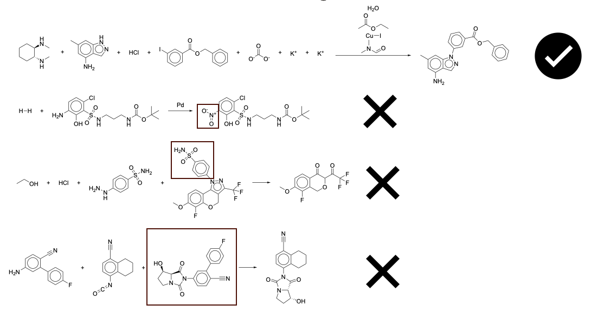
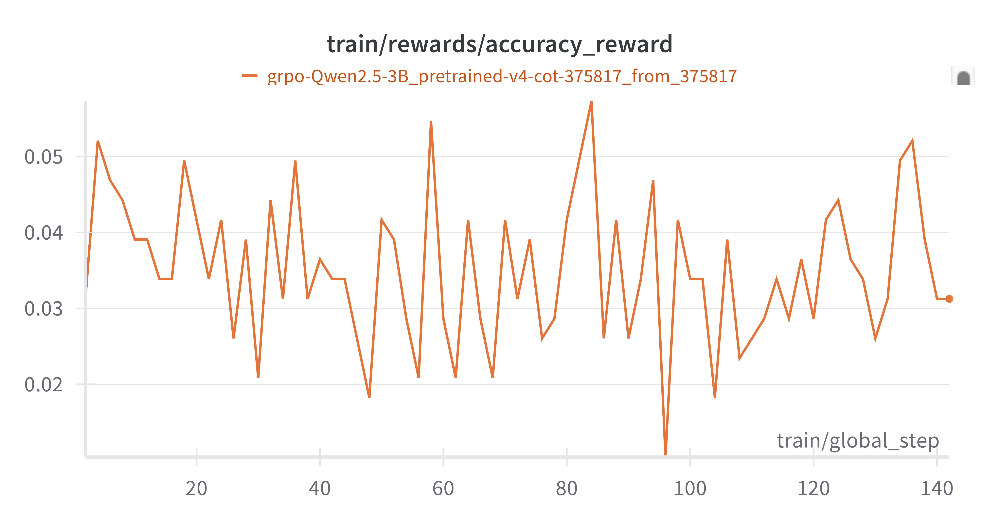
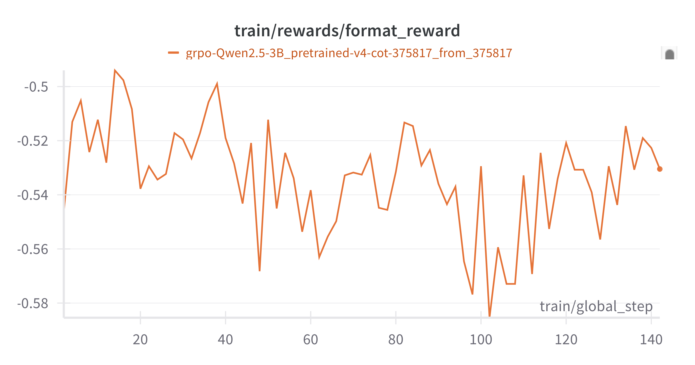

Correct Reaction MCQA
===================

.. currentmodule:: open_r1.tasks.reactions

SmilesInversion
-------------

.. autoclass:: SmilesInversion
   :members:
   :show-inheritance:

Task Description
--------------
The Correct Reaction MCQA task is designed to identify the correct chemical reactions provided as SMILES when provided as a MCQA type question, where four choices are presented. The task was created using USPTO molecular dataset.Fake reactions were designed by inverted the position of the longest SMILES string in the reagents side of the reaction with a random product. 

Features
--------

- Provides testing groud for classification of varied reactions 
- Handles substrate, product, and catalyst SMILES data
- Provides detailed reasoning process for the classification choice

Usage Example
-----------

.. code-block:: python

    from open_r1.tasks.reactions.mcqa_reaction_diff import SmilesInversion

    # Initialize the task
    task = SmilesInversion(
        dataset_id_or_path="path/to/reaction_mcqa_replacement_data",
    )

    # Load the dataset
    dataset = task.load()
   
    completions = ["<answer>A</answer>"]
    solution = ["prompt_true"]

Data Format
----------

The task expects data files in the following format:

- `prompt_true`: In the following reaction, the reagents are: [BEGIN_SMILES] CCCCOc1nc(N)c2nc(OC)n(CCCC3CCCCN3C(=O)OCc3ccccc3)c2n1 [END_SMILES], [BEGIN_SMILES] CCC[C@H](C)Oc1nc(N)c2nc(OC)[nH]c2n1 [END_SMILES], [BEGIN_SMILES] O=C(O)C(F)(F)F [END_SMILES], [BEGIN_SMILES] O=C(OCc1ccccc1)N1CCCC(CCCBr)C1 [END_SMILES] and the product is: [BEGIN_SMILES] CCC[C@H](C)Oc1nc(N)c2nc(OC)n(CCCC3CCCN(C(=O)OCc4ccccc4)C3)c2n1 [END_SMILES].
- `fake1`: This column contains a similar prompt as the "prompt_true", but contains a first example of a fake reaction.
- `fake2`: This column contains a similar prompt as the "prompt_true", but contains a second example of a fake reaction.
- `fake3`: This column contains a similar prompt as the "prompt_true", but contains a third example of a fake reaction.

Reward Functions
--------------

1. **Option String Matching (accuracy_reward)**
   
completions = ["<answer>A</answer>"]
solution    = ["prompt_true"]
options     = [["prompt_true","fake1","fake2","fake3"]]

rewards = task.accuracy_reward(completions, solution, options=options)

Task Example
-----------

.. code-block:: text

   Datta Example: 
   prompt_true, true_reaction, fake1, fake2, fake3

   "In the following reaction, the reagents are: [BEGIN_SMILES] CCCCOc1nc(N)c2nc(OC)n(CCCC3CCCCN3C(=O)OCc3ccccc3)c2n1 [END_SMILES], [BEGIN_SMILES] CCC[C@H](C)Oc1nc(N)c2nc(OC)[nH]c2n1 [END_SMILES], [BEGIN_SMILES] O=C(O)C(F)(F)F [END_SMILES], [BEGIN_SMILES] O=C(OCc1ccccc1)N1CCCC(CCCBr)C1 [END_SMILES] and the product is: [BEGIN_SMILES] CCC[C@H](C)Oc1nc(N)c2nc(OC)n(CCCC3CCCN(C(=O)OCc4ccccc4)C3)c2n1 [END_SMILES]."	
   
   "In the following reaction, the reagents are: [BEGIN_SMILES] CCOCC [END_SMILES], [BEGIN_SMILES] Cl [END_SMILES], [BEGIN_SMILES] FB(F)F [END_SMILES], [BEGIN_SMILES] Fc1ccccc1F [END_SMILES], [BEGIN_SMILES] [Li]CCCC [END_SMILES], [BEGIN_SMILES] CCCCCCC(O)Cc1cccc(F)c1F [END_SMILES], the condition is: [BEGIN_SMILES] C1COCC1 [END_SMILES], and the product is: [BEGIN_SMILES] CCCCCCC1CO1 [END_SMILES]."	
   
   "In the following reaction, the reagents are: [BEGIN_SMILES] O=Cc1ccc2[nH]ncc2c1 [END_SMILES], [BEGIN_SMILES] O=Cc1ccc2c(cnn2Cc2ccc(Cl)cc2C(F)(F)F)c1 [END_SMILES] and the product is: [BEGIN_SMILES] FC(F)(F)c1cc(Cl)ccc1CBr [END_SMILES]."
   
   "In the following reaction, the reagents are: [BEGIN_SMILES] CCN(C(C)C)C(C)C [END_SMILES], [BEGIN_SMILES] CCN=C=NCCCN(C)C [END_SMILES], [BEGIN_SMILES] Cl [END_SMILES], [BEGIN_SMILES] NC1CCCC(CNC(=O)OCc2ccccc2)C1 [END_SMILES], [BEGIN_SMILES] On1nnc2cccnc21 [END_SMILES], [BEGIN_SMILES] Cc1onc(-c2ncc(Cl)cc2Cl)c1C(=O)NC1CCCC(CNC(=O)OCc2ccccc2)C1 [END_SMILES], the condition is: [BEGIN_SMILES] CN(C)C=O [END_SMILES], and the product is: [BEGIN_SMILES] Cc1onc(-c2ncc(Cl)cc2Cl)c1C(=O)O [END_SMILES]."

   Reasoning: <think>
   The first reaction contains ...
   The second reaction would be wrong ...
   ...
   Therefore, the first reaction is the correct one ...
   </think>
   </answer>
   \\boxed{A}
   </answer>

   Results
-----------

1. **Reasoning output**

- `Positive points`: The task stimulates the model's ability to understand chemical reaction, without asking it to predict the product. The reagents and products are given, so the model can diffuse to the answer by resonning. The model reasons well about chemical reaction and provides even details about the steps happening in a given reaction. The reasoning and SMILES writting is consistent in some correct examples.

- `Negative points`: So far, no clear improvement in the accuracy plots. The model struggles to proprely format the MCQA answer.

Here is an example of a correctly answered question by Qwen2.5-3B_pretrained-v4-cot model:

====== CORRECT COMPLETION DUMP  ======
Choice: 'A'  Selected: 'In the following reaction, the reagent is: [BEGIN_SMILES] c1ccc(CN2CCC3(C2)OCc2ccccc23)cc1 [END_SMILES], the conditions are: [BEGIN_SMILES] CO [END_SMILES], [BEGIN_SMILES] [Pd] [END_SMILES], and the product is: [BEGIN_SMILES] c1ccc2c(c1)COC21CCNC1 [END_SMILES].

'Gold: 'In the following reaction, the reagent is: [BEGIN_SMILES] c1ccc(CN2CCC3(C2)OCc2ccccc23)cc1 [END_SMILES], the conditions are: [BEGIN_SMILES] CO [END_SMILES], [BEGIN_SMILES] [Pd] [END_SMILES], and the product is: [BEGIN_SMILES] c1ccc2c(c1)COC21CCNC1 [END_SMILES].'

<think> The correct answer is A.

`Explanation`: 
C is `not the correct answer`. The starting material is [START_SMILES] c1ccc(CN2CCC3(C2)OCc2ccccc23)cc1 [END_SMILES] and the product is [START_SMILES] c1ccc2c(c1)COC21CCNC1 [END_SMILES] (a bicyclic compound with a secondary amine). The reagents [START_SMILES] CO [END_SMILES] [START_SMILES] [Pd] [END_SMILES] and [START_MOL] methanol [END_MOL][START_SMILES] CO [END_SMILES] are all used in a catalytic hydrogenation reaction to reduce the nitrile group in the starting material to a primary amine. The reaction conditions involve hydrogenation with [START_MOL] palladium [END_MOL][START_SMILES] [Pd] [END_SMILES] as a catalyst and [START_MOL] methanol [END_MOL][START_SMILES] CO [END_SMILES] as a source of [START_MOL] hydrogen [END_MOL][START_SMILES] [HH] [END_SMILES]. The [START_MOL] bromide [END_MOL][START_SMILES] [Br-] [END_SMILES] in the starting material ([START_SMILES] c1ccc(CN2CCC3(C2)OCc2ccccc23)cc1 [END_SMILES]) is replaced by a [START_MOL] hydrogen [END_MOL][START_SMILES] [HH] [END_SMILES] atom in the product.

B is `not the correct answer`. The reaction involves a nucleophilic substitution where the [START_MOL] sulfur [END_MOL][START_SMILES] [S] [END_SMILES] atom in the starting material ([START_SMILES] Cc1cc(-c2ccc([N+](=O)[O-])cc2)ccc1C(=O)CBr [END_SMILES]) attacks the electrophilic [START_MOL] nitrogen [END_MOL][START_SMILES] [N] [END_SMILES] in [START_SMILES] Nc1ccc(OC2CCN(C3CC3)CC2)c(Br)c1 [END_SMILES] displacing the [START_MOL] bromide [END_MOL][START_SMILES] [Br-] [END_SMILES] ion. The product forms a new [START_SMILES] C-N [END_SMILES] bond, resulting in [START_SMILES] CC(=O)c1ccc(-c2ccc([N+](=O)[O-])cc2)cc1C [END_SMILES] with [START_MOL] oxetane [END_MOL][START_SMILES] C1COC1 [END_SMILES] as a byproduct.

D is `not the correct answer`. The reaction involves a nucleophilic substitution where the [START_MOL] sulfur [END_MOL][START_SMILES] [S] [END_SMILES] atom in the starting material ([START_SMILES] Cc1cc(-c2ccc([N+](=O)[O-])cc2)ccc1C(=O)CBr [END_SMILES]) attacks the electrophilic [START_MOL] nitrogen [END_MOL][START_SMILES] [N] [END_SMILES] in [START_SMILES] Cc1ccc(S(=O)(=O)O)cc1 [END_SMILES] displacing the [START_MOL] bromide [END_MOL][START_SMILES] [Br-] [END_SMILES] ion. The product forms a new [START_SMILES] C-S [END_SMILES] bond, resulting in [START_SMILES] Sc1nnc(-c2ccc3[nH]cnc3c2)o1 [END_SMILES] with [START_MOL] oxetane [END_MOL][START_SMILES] C1COC1 [END_SMILES] as a byproduct.

The correct answer is A, as the reaction involves a `hydrogenation of the nitrile group` in the starting material to a secondary amine. </think><answer> A </answer> 
====== END COMPLETION ====== 

2. **GRPO training performances**

The performances suggest that the model struggles to reach the random baseline (25%). The reason for this result for the trained model could also strongly be caused to formating struggles. 

The performances suggest that the model struggles to reach positive reward format.

