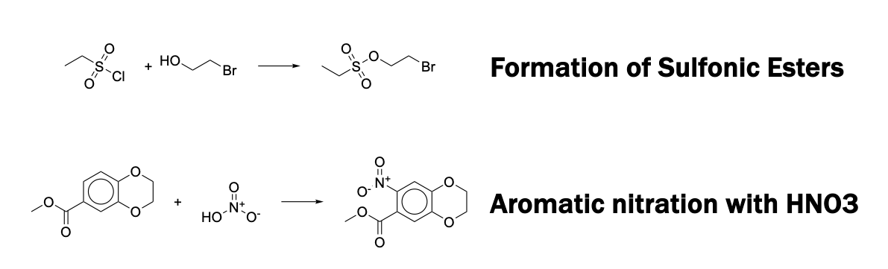
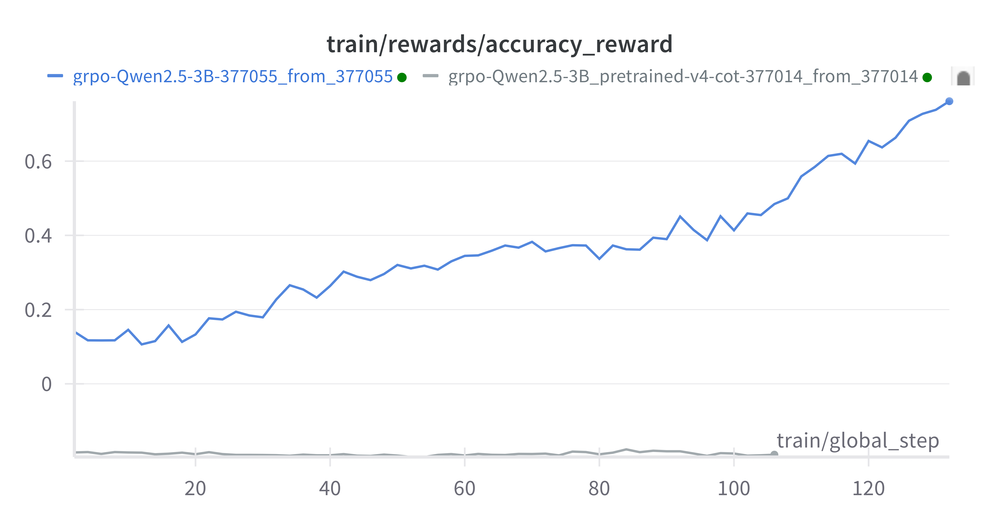
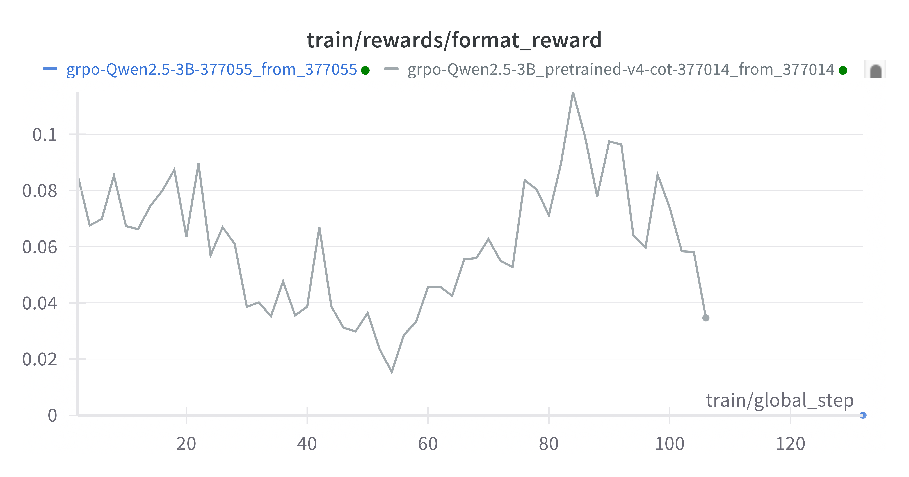

Reaction Name Classification
===================

.. currentmodule:: open_r1.tasks.reactions

Smiles2Name
-------------

.. autoclass:: Smiles2Name
   :members:
   :show-inheritance:

Task Description
--------------
The Reaction Name Classification task is designed to identify and classifify chemical reactions provided as SMILES to one of the different reaction classes. The task was created using USPTO Reaction dataset and Rxn-INSIGHT librairy to label chemical reactions. 

Features
--------

- Supports classification of varied reactions 
- Handles substrate, product, and catalyst SMILES data
- Provides detailed reasoning process for the classification choice

Usage Example
-----------

.. code-block:: python

    from open_r1.tasks.reactions.reaction2name import Smiles2Name

    # Initialize the task
    task = [TaskClassName](
        dataset_id_or_path="path/to/reaction_class_data",
    )

    # Load the dataset
    dataset = task.load()

    # Example of reward calculation
    completions = ["<answer>Acylation</answer>"]
    solution = ["Acylation"]
    rewards = task.accuracy_reward(completions, solution)

Data Format
----------

The task expects data files in the following format:

- `REACTION_PROMPT`: Column containing the reaction SMILES using the following template: "In the following reaction, the reagents are: [BEGIN_SMILES] reagent1 [END_SMILES], [BEGIN_SMILES] reagent2 [END_SMILES], the product is: [BEGIN_SMILES] product [END_SMILES]."
- `CLASS`: Column with the class of the reaction

Reward Functions
--------------

1. **String Matching (accuracy_reward)**
   
For each model completion it extracts the <answer> tags, compares them to the gold label, and assigns +1.0 if exactly correct, +0.2 if it at least picked a valid class, or –0.2 otherwise. It additionally scans the <think> reasoning block and tacks on an extra +0.1 whenever any valid class name appears in the rationale.

Task Example
-----------

.. code-block:: text

   Datta Example: 
   REACTION_PROMPT, CLASS
   "In the following reaction, the reagents are: [BEGIN_SMILES] NC1CC1 [END_SMILES], [BEGIN_SMILES] O=C(NC(Cc1ccccc1)C(O)C(=O)O)c1cccnc1-n1cc2c(n1)CCCC2 [END_SMILES], the product is: [BEGIN_SMILES] O=C(NC(Cc1ccccc1)C(O)C(=O)NC1CC1)c1cccnc1-n1cc2c(n1)CCCC2 [END_SMILES].", Acylation
   
   Output: Acylation
   Reasoning: <think>
   The reaction shows the presence of ...
   The product formed is ...
   Therefore, the reaction should be Sulfonic Esters Formation
   </think>
   </answer>
   \\boxed{Formation of Sulfonic Esters}
   </answer>

Results
-----------

1. **Reasoning output**

- `Positive points`: The task stimulates the model's ability to understand chemical reaction, without asking it to predict the product. The reagents and products are given, so the model can diffuse to the answer by resonning. The model reasons well about chemical reaction and provides even details about the steps happening in a given reaction. The reasoning and SMILES writting is consistent in some correct examples.

- `Negative points`: So far, no clear improvement in the accuracy plots with the trained models. The model struggles to proprely format the answer.

Here is an example of a correctly answered question by Qwen2.5-3B_pretrained-v4-cot model:

====== CORRECT COMPLETION ====== 

All Completion: <think> The reaction involves the acylation of an aromatic heterocycle by an acyl group. Here'sCCCC** acts as a source of [START_MOL] acetyl [END_MOL][START_SMILES] C[C]=O [END_SMILES] ([START_MOL] acetate [END_MOL][START_SMILES] CC(=O)[O-] [END_SMILES]) ([START_SMILES] O=C=CO [END_SMILES]), while [START_SMILES] O=S(=O)(Oc1cccc2ncccc12)C(F)(F)F [END_SMILES] provides the [START_MOL] sulfonyl [END_MOL][START_SMILES] O=S=O [END_SMILES] group and [START_MOL] trifluoromethyl [END_MOL][START_SMILES] F[C](F)F [END_SMILES] ([START_SMILES] C(F)(F)F [END_SMILES]). The product2ncccc12 [END_SMILES]** retains the [START_MOL] indole [END_MOL][START_SMILES] c1ccc2[nH]ccc2c1 [END_SMILES] ring ([START_SMILES] c1ccc2[nH]ccc2c1 [END_SMILES]), with the [START_MOL] nitrogen [END_MOL][START_SMILES] [N] [END_SMILES] now substituted by an acetyl group** ([START_SMILES] CC(=O) [END_SMILES]).

**Mechanism** reacts with the sulfonate ester to generate an acylium ion. This intermediate undergoes nucleophilic attack by the [START_MOL] indole [END_MOL][START_SMILES] c1ccc2[nH]ccc2c1 [END_SMILES] [START_MOL] nitrogen [END_MOL][START_SMILES] [N] [END_SMILES], displ=C and forming a `new bond between the acetyl group` and the [START_MOL] indole [END_MOL][START_SMILES] c1ccc2[nH]ccc2c1 [END_SMILES]. The sulfonate group stabilizes intermediates via charge transfer, and [START_SMILES] O=C=CO [END_SMILES] provides the `acylating agent`.

Final Answer: The reaction is an acylation** (likely mediated by a Lewis acid or activated ester activation). `The product forms via acyl transfer` to the [START_MOL] indole [END_MOL][START_SMILES] c1ccc2[nH]ccc2c1 [END_SMILES] [START_MOL] nitrogen [END_MOL][START_SMILES] [N] [END_SMILES], replacing the [START_MOL] hydrogen [END_MOL][START_SMILES] [HH] [END_SMILES] with an acetyl group. </think><answer> Acylation </answer>

====== END COMPLETION ====== 

2. **GRPO training performances**

ned. 

The perforamnces suggest that the model struggles to reach the random baseline (10%). In opposition to that, the control run with base Qwen model show proper ability of learning from GRPO pipeline. The reason for this result for the trained model could also strongly be caused to formating struggles. 

d. 

The format reward trend for the pretrained model is observed to be more stable than the one with the control base model. However, both models struggle to get the class prediction format correctly. Further format designing will be tested. 

