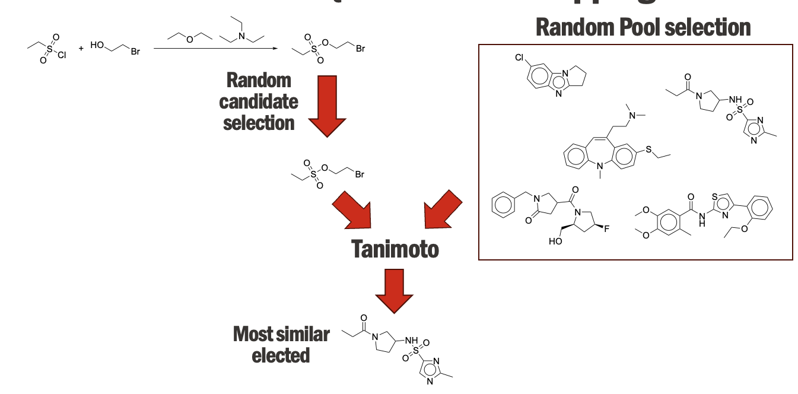
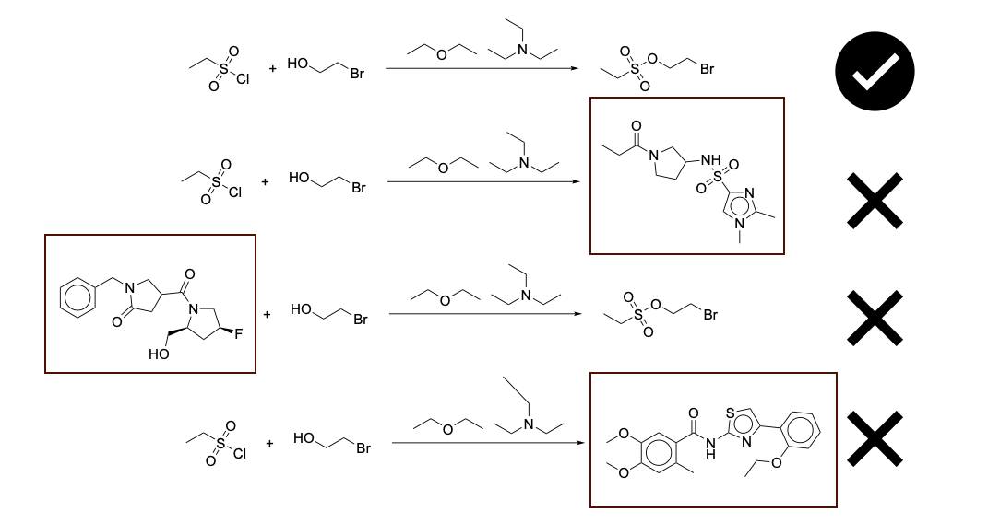
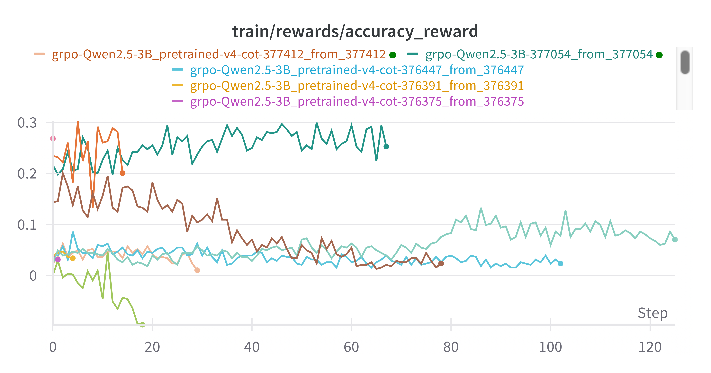
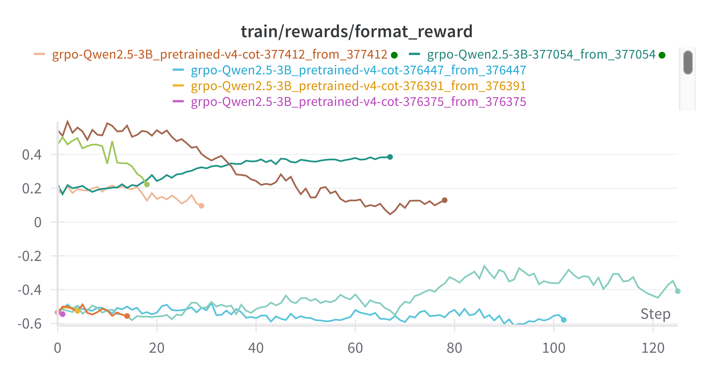

Correct Inversion Reaction MCQA
===================

.. currentmodule:: open_r1.tasks.reactions

SmilesReplacement
-------------

.. autoclass:: SmilesReplacement
   :members:
   :show-inheritance:

Task Description
--------------
The Correct Inversion Reaction MCQA task is designed to identify the correct chemical reactions provided as SMILES when provided as a MCQA type question, where four choices are presented. The task was created using USPTO molecular dataset as basis. Fake reactions were designed by randomly replacement a SMILES string in the reaction with the most similar compound from a randomly sampled pool of SMILES from the Enamine50k dataset. The similarities were computed with Tanimoto calculations.

Features
--------

- Provides testing groud for classification of varied reactions 
- Handles substrate, product, and catalyst SMILES data
- Provides detailed reasoning process for the classification choice

Usage Example
-----------

.. code-block:: python

    from open_r1.tasks.reactions.mcqa_inversion import SmilesReplacement

    # Initialize the task
    task = SmilesReplacement(
        dataset_id_or_path="path/to/reaction_mcqa_inversion_data",
    )

    # Load the dataset
    dataset = task.load()
   
    completions = ["<answer>A</answer>"]
    solution = ["prompt_true"]

Data Format
----------

The task expects data files in the following format:

- `prompt_true`: "In the following reaction, the reagents are: [BEGIN_SMILES] CCS(=O)(=O)Cl [END_SMILES], [BEGIN_SMILES] OCCBr [END_SMILES], the conditions are: [BEGIN_SMILES] CCN(CC)CC [END_SMILES], [BEGIN_SMILES] CCOCC [END_SMILES], and the product is: [BEGIN_SMILES] CCS(=O)(=O)OCCBr [END_SMILES]."	"In the following reaction, the reagents are: [BEGIN_SMILES] CCS(=O)(=O)Cl [END_SMILES], [BEGIN_SMILES] OCCBr [END_SMILES], the conditions are: [BEGIN_SMILES] CCN(CC)CC [END_SMILES], [BEGIN_SMILES] CCOCC [END_SMILES], and the product is: [BEGIN_SMILES] CCS(=O)(=O)OCCBr [END_SMILES]".
- `fake1`: This column contains a similar prompt as the "prompt_true", but contains a first example of a fake reaction.
- `fake2`: This column contains a similar prompt as the "prompt_true", but contains a second example of a fake reaction.
- `fake3`: This column contains a similar prompt as the "prompt_true", but contains a third example of a fake reaction.

Reward Functions
--------------

1. **Option Matching (accuracy_reward)**
   
completions = ["<answer>A</answer>"]
solution    = ["prompt_true"]
options     = [["prompt_true","fake1","fake2","fake3"]]

rewards = task.accuracy_reward(completions, solution, options=options)

Task Example
-----------

.. code-block:: text

   Datta Example: 
   prompt_true, fake1, fake2, fake3

   "In the following reaction, the reagents are: [BEGIN_SMILES] CCS(=O)(=O)Cl [END_SMILES], [BEGIN_SMILES] OCCBr [END_SMILES], the conditions are: [BEGIN_SMILES] CCN(CC)CC [END_SMILES], [BEGIN_SMILES] CCOCC [END_SMILES], and the product is: [BEGIN_SMILES] CCS(=O)(=O)OCCBr [END_SMILES]."	"In the following reaction, the reagents are: [BEGIN_SMILES] CCS(=O)(=O)Cl [END_SMILES], [BEGIN_SMILES] OCCBr [END_SMILES], the conditions are: [BEGIN_SMILES] CCN(CC)CC [END_SMILES], [BEGIN_SMILES] CCOCC [END_SMILES], and the product is: [BEGIN_SMILES] CCS(=O)(=O)OCCBr [END_SMILES].",	
   
   "In the following reaction, the reagents are: [BEGIN_SMILES] CCS(=O)(=O)Cl [END_SMILES], [BEGIN_SMILES] OCCBr [END_SMILES], the conditions are: [BEGIN_SMILES] CCN(CC)CC [END_SMILES], [BEGIN_SMILES] CCOCC [END_SMILES], and the product is: [BEGIN_SMILES] CCC(=O)N1CCC(NS(=O)(=O)c2cn(C)c(C)n2)C1 [END_SMILES].",
   
   "In the following reaction, the reagents are: [BEGIN_SMILES] O=C1CC(C(=O)N2C[C@@H](F)C[C@H]2CO)CN1Cc1ccccc1 [END_SMILES], [BEGIN_SMILES] OCCBr [END_SMILES], the conditions are: [BEGIN_SMILES] CCN(CC)CC [END_SMILES], [BEGIN_SMILES] CCOCC [END_SMILES], and the product is: [BEGIN_SMILES] CCS(=O)(=O)OCCBr [END_SMILES].",
   
   "In the following reaction, the reagents are: [BEGIN_SMILES] CCS(=O)(=O)Cl [END_SMILES], [BEGIN_SMILES] OCCBr [END_SMILES], the conditions are: [BEGIN_SMILES] CCN(CC)CC [END_SMILES], [BEGIN_SMILES] CCOCC [END_SMILES], and the product is: [BEGIN_SMILES] CCOc1ccccc1-c1csc(NC(=O)c2cc(OC)c(OC)cc2C)n1 [END_SMILES].",

   "Output: In the following reaction, the reagents are: [BEGIN_SMILES] CCS(=O)(=O)Cl [END_SMILES], [BEGIN_SMILES] OCCBr [END_SMILES], the conditions are: [BEGIN_SMILES] CCN(CC)CC [END_SMILES], [BEGIN_SMILES] CCOCC [END_SMILES], and the product is: [BEGIN_SMILES] CCS(=O)(=O)OCCBr [END_SMILES]."

   Reasoning: <think>
   The first reaction contains ...
   The second reaction would be wrong ...
   ...
   Therefore, the first reaction is the correct one ...
   </think>
   </answer>
   \\boxed{A}
   </answer>

Results
-----------

1. **Reasoning output**

- `Positive points`: The task stimulates the model's ability to understand chemical reaction, without asking it to predict the product. The reagents and products are given, so the model can diffuse to the answer by resonning. The model reasons well about chemical reaction and provides even details about the steps happening in a given reaction. The reasoning and SMILES writting is consistent in some correct examples.

- `Negative points`: So far, no clear improvement in the accuracy plots. The model struggles to proprely format the MCQA answer.

Here is an example of a correctly answered question by Qwen2.5-3B_pretrained-v4-cot model:

====== CORRECT COMPLETION ====== 

`Choice`: 'D'  Selected: 'In the following reaction, the reagents are: [BEGIN_SMILES] CCN1CCN(c2ccc(N)nc2)CC1 [END_SMILES], [BEGIN_SMILES] Cn1nc(Cl)cc(Br)c1=O [END_SMILES], the conditions are: [BEGIN_SMILES] C1COCCO1 [END_SMILES], [BEGIN_SMILES] CC1(C)c2cccc(P(c3ccccc3)c3ccccc3)c2Oc2c(P(c3ccccc3)c3ccccc3)cccc21 [END_SMILES], [BEGIN_SMILES] ClCCl [END_SMILES], [BEGIN_SMILES] O [END_SMILES], [BEGIN_SMILES] O=C(/C=C/c1ccccc1)/C=C/c1ccccc1 [END_SMILES], [BEGIN_SMILES] [Pd] [END_SMILES], and the product is: [BEGIN_SMILES] CCN1CCN(c2ccc(Nc3cc(Cl)nn(C)c3=O)nc2)CC1 [END_SMILES].'  
`Gold`: 'In the following reaction, the reagents are: [BEGIN_SMILES] CCN1CCN(c2ccc(N)nc2)CC1 [END_SMILES], [BEGIN_SMILES] Cn1nc(Cl)cc(Br)c1=O [END_SMILES], the conditions are: [BEGIN_SMILES] C1COCCO1 [END_SMILES], [BEGIN_SMILES] CC1(C)c2cccc(P(c3ccccc3)c3ccccc3)c2Oc2c(P(c3ccccc3)c3ccccc3)cccc21 [END_SMILES], [BEGIN_SMILES] ClCCl [END_SMILES], [BEGIN_SMILES] O [END_SMILES], [BEGIN_SMILES] O=C(/C=C/c1ccccc1)/C=C/c1ccccc1 [END_SMILES], [BEGIN_SMILES] [Pd] [END_SMILES], and the product is: [BEGIN_SMILES] CCN1CCN(c2ccc(Nc3cc(Cl)nn(C)c3=O)nc2)CC1 [END_SMILES].'

The product is [START_SMILES] CCN1CCN(c2ccc(Nc3cc(Cl)nn(C)c3=O)nc2)CC1 [END_SMILES] . The product SMILES is the result of a `nucleophilic substitution reaction`. The starting compound [START_SMILES] Cn1nc(Cl)cc(Br)c1=O [END_SMILES] contains a [START_MOL] bromine [END_MOL][START_SMILES] [Br] [END_SMILES] atom and a [START_MOL] bromide [END_MOL][START_SMILES] [Br-] [END_SMILES] ion (Br⁻). The reaction involves [START_MOL] Pd [END_MOL][START_SMILES] `[Pd]` [END_SMILES] as a `catalyst`, likely facilitating the substitution of [START_MOL] `bromide` [END_MOL][START_SMILES] [Br-] [END_SMILES] with a nucleophile. The nucleophile in this case is the [START_MOL] amine [END_MOL] group from the [START_MOL] morpholine [END_MOL][START_SMILES] C1COCCN1 [END_SMILES] derivative [START_SMILES] CCN1CCN(c2ccc(N)nc2)CC1 [END_SMILES] which acts as a nucleophile due to the lone pair on the [START_MOL] nitrogen [END_MOL][START_SMILES] [N] [END_SMILES] atom. This `substitution occurs via a [START_MOL] palladium [END_MOL][START_SMILES] [Pd] [END_SMILES]-mediated mechanism`, where the [START_MOL] bromide [END_MOL][START_SMILES] [Br-] [END_SMILES] is replaced by the [START_MOL] amine [END_MOL] group.

The product SMILES [START_SMILES] CCN1CCN(c2ccc(Nc3cc(Cl)nn(C)c3=O)nc2)CC1 [END_SMILES] reflects this substitution, where the [START_MOL] bromine [END_MOL][START_SMILES] [Br] [END_SMILES] atom in the starting material is replaced by an [START_MOL] `amine` [END_MOL] group connected to a [START_MOL] pyrazole [END_MOL][START_SMILES] c1cn[nH]c1 [END_SMILES] ring. The [START_MOL] pyrazole [END_MOL][START_SMILES] c1cn[nH]c1 [END_SMILES] ring ([START_SMILES] c3cc(Cl)nn(C)c3=O [END_SMILES]) retains its [START_MOL] chlorine [END_MOL][START_SMILES] [Cl] [END_SMILES] and [START_MOL] carbonyl [END_MOL][START_SMILES] C=O [END_SMILES] groups, and the [START_MOL] pyrazole [END_MOL][START_SMILES] c1cn[nH]c1 [END_SMILES] is linked to the [START_MOL] amine [END_MOL] via an [START_MOL] N [END_MOL][START_SMILES] [N] [END_SMILES]-bond.

The other options are incorrect because they either** involve `incorrect reactants` (e.g., no [START_MOL] bromide [END_MOL][START_SMILES] [Br-] [END_SMILES] substitution),** have `different substitution sites` (e.g., [START_MOL] chlorine [END_MOL][START_SMILES] [Cl] [END_SMILES] instead of [START_MOL] bromine [END_MOL][START_SMILES] [Br] [END_SMILES]), or involve unreactive reagents. The correct answer is D, where the reaction proceeds via [START_MOL] palladium [END_MOL][START_SMILES] [Pd] [END_SMILES]-catalyzed substitution of [START_MOL] bromide [END_MOL][START_SMILES] [Br-] [END_SMILES] by the [START_MOL] amine [END_MOL] group from the [START_MOL] morpholine [END_MOL][START_SMILES] C1COCCN1 [END_SMILES] derivative. </think><answer> D </answer>

====== END COMPLETION ====== 

2. **GRPO training performances**

model, non pretrained. 

Most runs displayed are from the pre-trained-v4-cot model on chemical data. The perforamnces suggest that the model struggles to reach the random baseline (25%). In opposition to that, the control run with base Qwen model show proper ability of learning from GRPO pipeline. The reason for this result for the trained model could also strongly be caused to formating struggles. 

del, non pretrained. 

Most runs ended with strong decrease in the format reward, showing that the model unlearns the proper thinking and answering format during the run. For the control run, the results display proper improvement over the number of steps, indicating a better adaptability of the GRPO training. 
