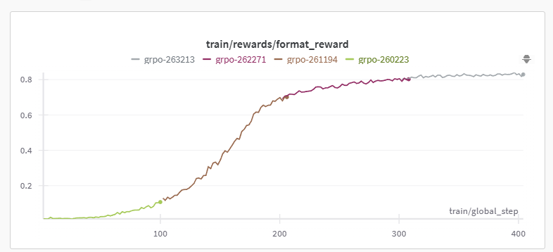
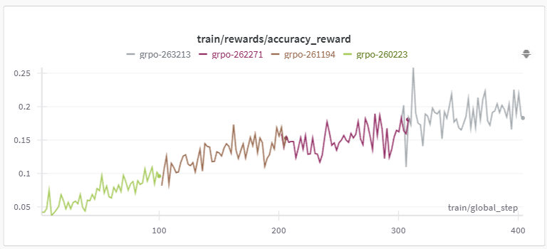
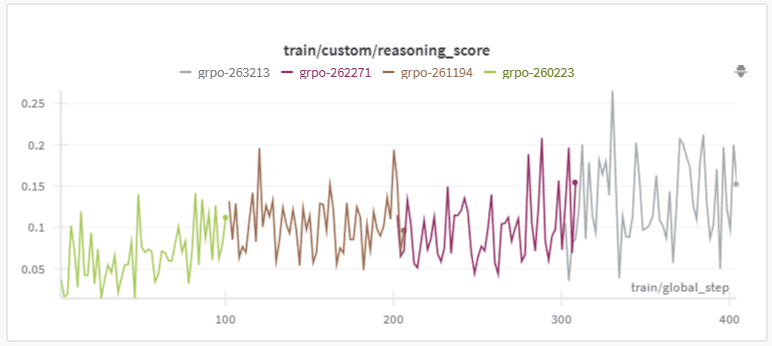
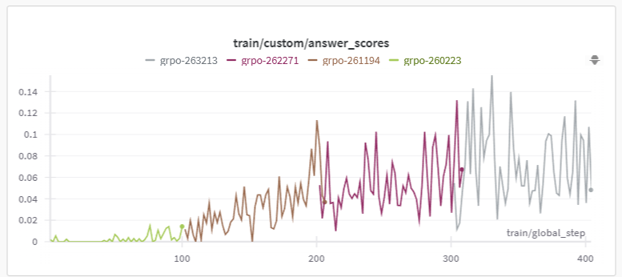
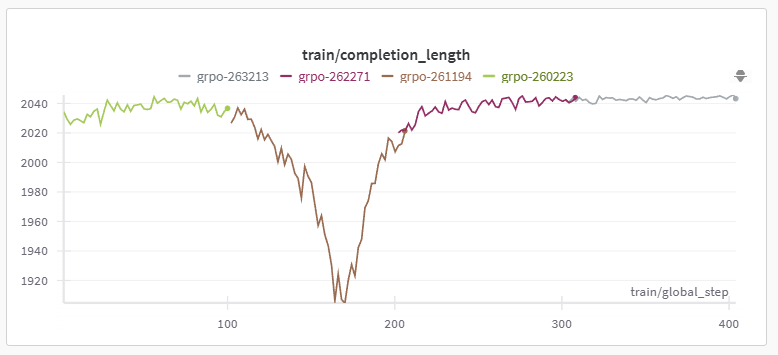
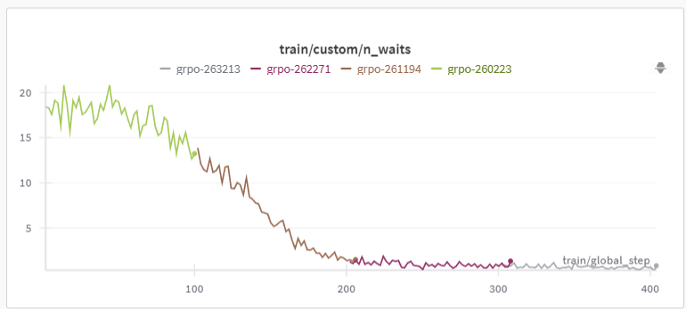
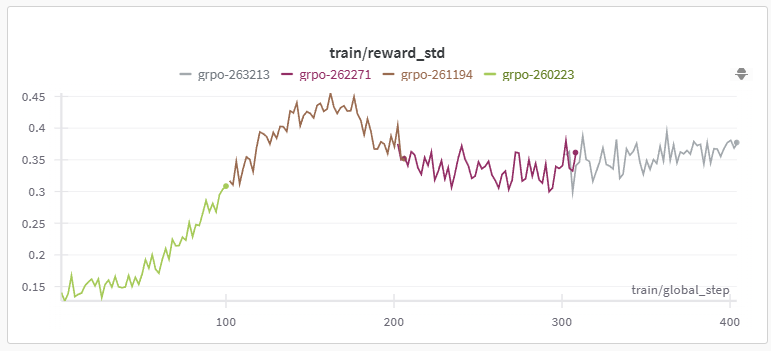

SMILES permutation
===================

.. currentmodule:: open_r1.tasks.smi_permute

PermuteSmiles
-------------

.. autoclass:: PermuteSmiles
   :members:
   :show-inheritance:

Task Description
----------------

Permuting SMILES string without changing the represented molecule. Rewards are calculate based on the edit-distance between the original and permuted SMILES strings.
The aim is to make the LLM understand the chemical structure behind the SMILES notation and improve its ability to write SMILES.

Features
--------
- A simple task serves as a proof of concept for subsequent tasks.
- The model can parse the the structure of SMILES notation, and write it in a different way.
- Rewards are calculated based on the normalized Levenshtein distance between the original and permuted SMILES strings output by the model, heavily penalized if Tanimoto similarity of the original and permuted SMILES is lower than 1.

Usage Example
-------------

.. code-block:: python

    from open_r1.tasks.smi_permute import PermuteSmiles

    # Initialize the task
    task = PermuteSmiles(
        dataset_id_or_path="path/to/data",
    )

    # Load the dataset
    dataset = task.load()

    # Example of reward calculation
    completions = ["<think>...</think>\n<answer>C1N(CCCC)C1</answer>"]
    solution = ["C1N(C1)CCCC"]
    rewards = task.accuracy_reward(completions, solution)

Data Format
-----------

Data should be provided to `dataset_id_or_path` as a path to a comma-separated csv file containing at least a columns named "SMILES" containing the SMILES strings to be permuted. The dataset can also contain other columns, but they will not be used in the task.

Reward Functions
----------------

1. **Format (format_reward)**
   
   This function evaluates the correctness of the completion format. First it looks for the regex pattern `<think>(.*?)<\/think>\s*<answer>(.*?)<\/answer>` the completion. Note that the start `^` and end `$` of line are omitted to allow for the presence of other text before or after the completion, however in that case the reward will be lower:
   - If a match is found: `reward = len(match.group(0)) / len(completion)`
   - if a match is not found: `reward = 0.0`

2. **Accuracy (accuracy_reward)**
   
   The current implementation of this reward is based on the observation that the reasoning of the LLM tends to propose a number of solutions, delimited by the "wait" keyword. Therefore this reward function will look for all SMILES strings can calculate a edit-distance-based score between them and the original. The best score will be used as the `reasoning_reward`. Addtionally, if the model manages to compile its answer into the `<answer>...</answer>` tags, the longest SMILES in this tag pair will be taken as the final answer from the model, and a `answer_score` will be calculated based on the edit-distance between the original and the answer. The final reward will be the sum of the two scores.

..    Given two SMILES strings `s1` and `s2`, and their respective molecules `m1` and `m2`, the score is calculated as follows:
..    score(s1, s2) = (min(d_edit))

Task Example
------------

.. code-block:: text

   Input: 'C1N(CCCC)C1'
   Output: 'C1N(C1)CCCC'

Experimental Details
--------------------

Base Model Used
^^^^^^^^^^^^^^^
Qwen2.5-3B_pretrained-v1_cot-v1 (old name: qwen-cot)

Job ID and the Run Name on WanDB
^^^^^^^^^^^^^^^^^^^^^^^^^^^^^^^^
- Job ID: 260223, 261194, 262271, 263213
  
- Run Name: grpo-260223, grpo-261194, grpo-262271, grpo-263213

Training Details
^^^^^^^^^^^^^^^^

.. code-block:: yaml

    # Model arguments
    model_revision: main
    torch_dtype: bfloat16
    attn_implementation: flash_attention_2
    bf16: true
    tf32: true

    # Chemical Task arguments
    chem_task: smi_permute
    dataset_id_or_path: /iopsstor/scratch/cscs/nnguyenx/datasets/sink/CRLLM-PubChem-compounds1M-very_very_simple.csv
    rewards:
    - format
    - accuracy

    # Training arguments
    max_steps: 1450
    per_device_train_batch_size: 1
    gradient_accumulation_steps: 8
    gradient_checkpointing: true
    gradient_checkpointing_kwargs:
    use_reentrant: false
    learning_rate: 5.0e-7 # 1.0e-6 as in the deepseek math paper 5-e7 from https://hijkzzz.notion.site/unraveling-rlhf-and-its-variants-engineering-insights#147d9a33ecc9806090f3d5c749d31f05
    lr_scheduler_type: cosine
    warmup_ratio: 0.03
    # GRPO specific parameters
    beta: 0.001 # 0.04 as in the deepseek math paper 0.001 from https://hijkzzz.notion.site/unraveling-rlhf-and-its-variants-engineering-insights#147d9a33ecc9806090f3d5c749d31f05
    max_prompt_length: 256
    max_completion_length: 2048
    num_generations: 8
    use_vllm: true
    vllm_device: "cuda:3"
    vllm_gpu_memory_utilization: 0.8
    vllm_max_model_len: 2048

    # Logging arguments
    logging_strategy: steps
    logging_steps: 2
    report_to:
    - wandb

    save_strategy: "steps"
    save_steps: 25
    seed: 42

    # Hugging Face Hub 
    push_to_hub: false
    # hub_model_id: llama-3-1-8b-math-orca-qlora-10k-ep1 # if not defined same as output_dir

Datasets used for RL
^^^^^^^^^^^^^^^^^^^^^^^^
The original dataset is taken from the file `CRLLM-PubChem-compounds1M.csv`. 
Then, only molecules with no more than 10 atoms are kept, resulting in 33,453 molecules.
Augmentation is done by combining these columns: `SMILES`, `SMILES_variant1`, `SMILES_variant2`, `SMILES_variant3`, `SMILES_variant4`, i.e. 5 times augmentation by SMILES permutation, resulting in 167,265 SMILES string.

The reason for using only molecules with no more than 10 atoms is that LLM is TERRIBLE at understanding complex SMILES strings. The run on this simple dataset serves as a proof of concept for subsequent tasks.

Prompt
^^^^^^^

.. code-block:: text

    You are an expert in Cheminformatics, who is very familiar with Simplified Molecular Input Line Entry System (SMILES) notation, and here's a task for you. Please permute the given SMILES sequence of a molecule, in such a way that the resulted SMILES is different from the input SMILES as much as possible, but the original molecule is not changed. Remember that your answer SMILES must satisfy two criteria: 1) it must be different from the input SMILES, and 2) it must represent the same molecule. Here is the SMILES that you need to work on: {input_SMILES}. <think>

Result
------

Reward Progression
^^^^^^^^^^^^^^^^^^
wandb link: https://wandb.ai/liac/r1-smi_permute/workspace?nw=nwuservunguyen
Visualize only these runs: grpo-260223, grpo-261194, grpo-262271, grpo-263213

- The model has learnt the completion format just by GRPO
- The format is low at the beginning due to the responses being cut off after 2048 tokens.

- Accuracy reward increased linearly from 0 to 0.2 after 400 steps.
- Note that the accuracy reward is the sum of the following:
    - reasoning reward: The highest score of the SMILES strings in the reasoning trace, ranged from 0 to 1. As mentioned, the score is a normalized Levenshtein distance between the original and permuted SMILES strings, penalized by the Tanimoto similarity.
    - answer reward: The score of the longest SMILES string in the `<answer>...</answer>` tags, ranged from 0 to 1.

- Therefore, the range of the accuracy reward is from 0 to 2.

- Progression of the reasoning reward.

- Progression of the answer reward.

- Completion length observed a cliff at around 180 steps, then increased back to 2048 tokens.

Notably, as the training going on, the number of "wait" keywords in the completions decreased from 20 on average to 0, suggesting that the model being more "confident" in its completion.

The cliff in the completion length also correspond with the peak in the reward standard deviation at around 180 steps.

Sample Responses
^^^^^^^^^^^^^^^^

At the beginning of the training (n_steps < 100):

- Input SMILES: 'C(CCO)(S(=O)(=O)O)C'
- Full response:

.. code-block:: text

    1. Understand the SMILES notation: The given SMILES is C(CCO)(S(=O)(=O)O)C. Let's break it down. The central carbon has three substituents: a propyl group (CCO), a sulfonyl oxy group (S(=O)(=O)O), and another carbon (C). So this is a central carbon with three branches: an ethoxy group (OCH2CH3?), a sulfonyloxy group (O-SO2-O), and a methyl group (CH3). Wait, but the SMILES notation might be C(CCO)(S(=O)(=O)O)C. Let me parse this correctly. The central atom is a carbon connected to three groups:
    - The first branch is CCO: which is a propyl group (CH2CH2O?), but actually, CCO would be CH2CH2O, but with the central carbon. Wait, maybe it's a propane chain: the central carbon is connected to a CH2CH2O group? Wait, no. Let me draw it out. The central carbon (let's represent as C1) is connected to three groups:
        1. A propyl group (CCO): So starting with the central C, connected to a C, then another C, then O. So that's CH2CH2OH? Wait, no. Wait, SMILES notation is sequential. So CCO would be C-C-O. So the first C is the central C, then a C connected to it, then O. So the propyl group is CH2CH2OH? Wait, but O in SMILES is an ether unless charged. Wait, maybe the propyl group is CH2CH2O-, but in the given SMILES, there's no charge. Hmm. Let me think again. The SMILES is C(CCO)(S(=O)(=O)O)C. So the central C has three substituents:
        - The first substituent is CCO. So starting from the central C, connected to another C, then another C, then O. So that's C-CH2-CH2-O? Wait, but the central C is connected to the first C, which is then connected to another C, then O. So the substituent is -CH2CH2O. But the central C is also connected to S(=O)(=O)O and another C. So the central C has three branches:
        1. -CH2CH2O (from CCO)
        2. -S(=O)(=O)O
        3. -CH3 (from the last C in the SMILES)
    Wait, but the last part is C, which is a methyl group. So the central C is connected to a propyl group (CCO), a sulfonyloxy group (S(=O)(=O)O), and a methyl group (CH3). So the structure is a central carbon with three substituents: a propyl ether, a sulfonyloxy, and a methyl group.

    2. Now, to permute the SMILES while maintaining the same structure but making it different. The key is to change one substituent without altering the core structure. For example, changing the propyl group to a butyl group, but that would change the molecular weight and other properties, which might not be allowed. Wait, but the question says the original molecule must not be changed. So permutations in SMILES notation might involve rearranging the substituents as long as the connectivity is maintained. Wait, but in SMILES, the order of substituents matters in terms of branching order, but as long as the connections are correct, rotating the branches doesn't count as a different structure. For example, C(CCO)(S(=O)(=O)O)C is the same as C(C)(CCOS)S(=O)(=O)O or any other order, because the branching is determined by the order. So perhaps the only way to create a different SMILES that represents the same molecule is to replace one of the substituents with a different group, as long as the valency and connectivity remain the same.
    Wait, but the central carbon has three substituents: the propyl group (CCO), the sulfonyloxy (S(=O)(=O)O), and the methyl (C). Wait, but the methyl is a single carbon, so maybe the substituents are:
    - CH2CH2O (from CCO)
    - SO2O (from S(=O)(=O)O)
    - CH3
    But in SMILES notation, the central C is connected to these three groups. So to permute the SMILES while keeping the same molecule, perhaps replace one of the substituents. For example, replacing the propyl group (CCO) with something else, but that would change the substituent. Alternatively, perhaps the sulfonyloxy group is written in a different order. Wait, but S(=O)(=O)O is the same as O=S(=O)(O), so the order of the substituents on the sulfur might not matter. Similarly, the propyl group (CCO) is just an ether substituent. The methyl is just a methyl group. So perhaps the only way to get a different SMILES is to have a different arrangement that still corresponds to the same structure. For example, maybe the propyl group is written as CCCO, but that would be a different structure. Wait, no. Let me think again. If the propyl group is C-C-O, that would be CH2CH2O, but in SMILES, the O would need to be connected properly. Wait, the propyl group here is part of a substituent attached to the central carbon. So the SMILES CCO would be a propyl group attached to the central carbon. But wait, in SMILES, the order is important. So CCO would be O-C-C, but the central C is connected to the first C, then the next C, then O. So the propyl group is actually CH2CH2O, but how is that connected? The central C is connected to another C, which is connected to another C, which is connected to O. So the substituent is -CH2CH2O. But in reality, the propyl group as a substituent would be written as CCC [some element], but here it's O. Wait, perhaps the substituent is an ethoxy group (OCH2CH3), but the SMILES is written as CCO. Wait, no. The SMILES CCO would be O-C-C, but the central C is connected to the first C, then the next C, then O. So the structure is C-C-O. So the central C is connected to a C, then another C, then O. So the substituent is -C-C-O. But in reality, that's CH2CH2O, which would be an ethoxy group with a methyl group attached? Wait, no. Let me draw it:

    Central carbon (C1) connected to C2, which is connected to C3, which is connected to O. So the substituent is C1-C2-C3-O. But C3 would need to have two hydrogens attached because it's connected to C2 and O. So the substituent is -CH2CH2O^-?, but there's no charge in the SMILES. Wait, maybe the O is part of an ether group. So the substituent is an ethoxy group (OCH2CH3), but written as CCO. Wait, no. CCO would be O-C-C, but the central C is connected to the first C, then the next C, then O. So the substituent is CH2CH2-O- but where is the other bond of the O? If it's O connected to C, then the O has two bonds: one to C (the central C) and one to something else. But in the given SMILES, the O is at the end, so maybe it's an alcohol? But then the O would have a hydrogen. Wait, the SMILES is C(CCO)(S(=O)(=O)O)C. The O at the end would have a hydrogen? Or is it part of a sulfate group? Wait, the S is connected to two O atoms with double bonds and one O with a double bond and another single bond. Let me parse the S part: S(=O)(=O)O. That would be a sulfonic acid group, but with two double bonds. Wait, S(=O)(=O)O would be O-S(=O)(=O)-O. But that's not a valid group. Wait, maybe it's a sulfate group, but sulfate usually has four oxygen atoms. Wait, perhaps the correct structure is a sulfonic acid group: -SO3H. But the SMILES for sulfonic acid is O=S(=O)(O)O. Wait, the given SMILES here is S(=O)(=O)O. Let me check: S connected to two =O groups and one O. That would be O-S(=O)(=O)O. But that's not a valid group. Wait, maybe it's a sulfonic acid ester or sulfonate. Alternatively, maybe it's a sulfonate group with an oxygen. Wait, perhaps the correct structure is a sulfonic acid group: the sulfur is double-bonded to two oxygen atoms and has a single-bonded hydroxyl group. So the SMILES should be O=S(=O`

The model tries to breakdown the structure of the molecules in its reasoning. The completion is cut-off thus the closing tag `</think>` is not reached. The best SMILES found in this reasoning trace is `C(C)(CCOS)S(=O)(=O)O`, which is not the same molecule with the input SMILES and thus the reasoning reward is 0.0003. It still gets a small reward to encourage it explore different permutations instead of copy the input SMILES (which would give it 0 score).

Note that at this phase, some SMILES strings found in the reasoning has already satisfied some criteria of the task. The model just either failed to conclude or moved on with another "wait".

At around 180 steps:

- Input SMILES: 'O=C(O)CCCCCCCl'
- Full response:

.. code-block:: text

    1. **Analyze the SMILES Structure**: The given SMILES is O=C(O)CCCCCCCl. Breaking it down, the central carbon is a carbonyl group (C=O), connected to an oxygen (O), making it a carboxylic acid (COOH). The rest of the molecule is a six-carbon chain (C6) ending with a chlorine atom (Cl). The structure is: COOH-(CH2)5-Cl.
    2. **Understand the Molecular Represenation**: The molecule is a 6-carbon chain with a carboxylic acid at one end and a chlorine atom at the other end. The carboxylic acid group is a functional group, and the chlorine is a substituent. The chain length is 6 carbons, but the chlorine is on the sixth carbon.
    3. **Key Concepts for Permutation**: The main goal is to create a different SMILES string that represents the same molecule but with structural variations that don't alter the underlying structure. This includes different atom orders, branch points, or even different element types, but ensuring the molecule remains the same.
    4. **Generate a Different SMILES**: To meet the criteria, the new SMILES must vary in structure without creating a different molecule. For example, keeping the same number of atoms and their order but changing the substituent positions or branches. However, since the molecule is linear with the carboxylic acid and chlorine at the ends, any permutation in the carbon chain might not change the structure.
    5. **Avoid Changing the Molecular Identity**: The key is to ensure that the SMILES notation remains equivalent to the original structure. For instance, the order of substituents on the carbon chain can vary as long as the connectivity and substituent positions are the same.
    6. **Create a Unique Variation**: Let's consider the SMILES O=C(O)CCCCCCCl. If we rearrange the carbons in a way that the chlorine is on a different carbon but maintains the same chain. For example, O=C(O)CCCC(Cl)CCC. Wait, but this would imply the chlorine is on the fourth carbon, which is the same as the original if we consider the direction. Alternatively, a different arrangement like O=C(O)CC(Cl)CCCCC. But this might not capture all possible permutations.

    7. **Finalizing the SMILES**: To ensure the SMILES is different but represents the same molecule, perhaps by introducing a branch without changing the main structure. However, the original structure is a straight chain. If we add a branch somewhere else, but that would create a different molecule. The challenge is to find a permutation where the SMILES string is different but the molecular structure remains the same.
    8. **Validation**: The original SMILES is O=C(O)CCCCCCCl. The new SMILES must have the same number of atoms, the same connectivity, and the same functional groups. Any variation in the order of atoms (as long as the branches are correctly placed) should work. For example, reversing the order of the chain would give ClCCCCC(CC(=O)O). But this is essentially the same molecule; the SMILES is just written in the reverse direction, which doesn't change the molecular structure.
    9. **Conclusion**: The answer should be a SMILES string that is a different arrangement of the original atoms but maintains the same connectivity and functional groups. Reversing the chain while keeping the branches in the same positions would satisfy this. Therefore, the SMILES O=C(O)CCCCCCCl is already in a form where the chain can be written in reverse without changing the structure, but perhaps a different substitution pattern could be considered.
    Wait, but the original SMILES is COOH-(CH2)5-Cl. If I create a different SMILES by starting with the chlorine and ending with the carboxylic acid, like Cl-(CH2)5-COOH. The SMILES would be O=C(O)CCCC(Cl)CC. However, this is the same molecule as the original but written from the chlorine end. Since SMILES can be written in either direction (as long as the branches are correctly placed), this is acceptable. But the question states that the new SMILES must be different from the input SMILES. So, I need to find a different structure that is chemically the same.
    Alternatively, perhaps adding a methyl group somewhere but in a way that the overall structure remains the same. For example, if the original is a hexyl chain with COOH and Cl at the ends, adding a methyl on the sixth carbon might change the structure, but that would create a new isomer.
    Wait, perhaps the original SMILES is O=C(O)CCCCCCCl. Let's count the atoms: 1 (C=O), then O, then 6 Cs (C-C-C-C-C-C), then Cl. So total 8 atoms: O, O, C, C, C, C, C, C, Cl. The same structure can also be written as ClC(C)(C)CCCCCC(=O)O. Here, the chlorine is attached to the first carbon, and the carboxylic acid is at the end. This is the same molecule but with the chlorine on a different carbon. However, this would still have the same molecular structure as the original.
    To generate a different SMILES that represents the same molecule, perhaps by changing the order of the substituents. For example, O=C(O)C(Cl)CCCCC. But this would imply that the chlorine is on the second carbon, which is a different position. However, the molecular structure remains the same because the carboxylic acid and chlorine are still at the terminal ends.

    After considering these possibilities, the answer should be a SMILES string that is a non-reversible permutation of the original, as long as the molecular structure remains unchanged. Therefore, the original SMILES O=C(O)CCCCCCCl can be written in a different order, such as ClCCCCC(CC(=O)O), but this would actually represent a different molecule where the chlorine is on the first carbon. Therefore, the correct way to create a different SMILES but represent the same molecule is to ensure the SMILES is written in reverse, which is acceptable as long as the branches are correctly placed.
    However, the question specifies that the new SMILES must be different from the input SMILES. Therefore, I need to find a way to create a different SMILES that is equivalent. Another approach is to introduce a different substituent while keeping the rest the same. For example, replacing the chlorine with a different atom, but the question specifies that the original molecule should not be changed, only the SMILES permutation.
    Given that, the only way to have a different SMILES while representing the same molecule is to arrange the substituents in a different order without changing the connectivity. For example, the original SMILES is COOH-(CH2)5-Cl. If we write it as Cl-(CH2)5-COOH, which is O=C(O)CCCC(Cl)CC. This is chemically the same molecule but written with the chlorine first. Therefore, this is the answer.
    </think><answer> **Answer:**
    The equivalent SMILES that satisfies the criteria is `O=C(O)CCCC(Cl)CC`.
    **Step-by-Step Explanation:**
    1. **Analyze the Original Structure:**
    The given SMILES `O=C(O)CCCCCCCl` represents a 6-carbon chain with a carboxylic acid group (`COOH`) at one end and a chlorine atom (`Cl`) at the other. The structure is linear: **COOH-(CH₂)₅-Cl**.
    2. **Understand Molecular Equivalence:**
    In SMILES notation, the order of atoms and branches does not inherently alter the molecular structure. The molecule is fully defined by its connectivity and substituents, regardless of writing direction or branch order.
    3. **Create a Differently Ordered SMILES:**
    To generate a new SMILES that is structurally identical but written differently, we reverse the chain while maintaining the branch positions. The new SMILES becomes **Cl-(CH₂)₅-COOH**, written as `O=C(O)CCCC(Cl)CC`.

    4. **Verify Equivalence:**
    - **Connectivity:** Both SMILES strings have the same backbone (6 carbons) with a carboxylic acid and chlorine at the terminal ends.
    - **Substituents:** The chlorine and carboxylic acid are at positions 1 and 6 relative to the central chain.
    - **Molecular Formula:** Each structure corresponds to **C₆H₁₃ClO₂**, confirming no changes in the molecular identity.
    5. **Respect the Constraints:**
    - The new SMILES (`O=C(O)CCCC(Cl)CC`) is different from the original in atom ordering but remains chemically equivalent.
    - All valences and functional groups (carboxylic acid, chlorine) are preserved.
    **Conclusion:**
    The SMILES `O=C(O)CCCC(Cl)CC` meets the criteria for a structurally distinct but chemically identical representation of the original molecule. </answer>

The model has figured out the format with correct tag. Note that the opening `<think>` tag is put in the prompt.
The reasoning starts to adope a more step-by-step format with distintive step names (`1. **Analyze the SMILES Structure**`, `2. **Understand the Molecular Represenation**`, etc.), with less "wait" keywords.

The final answer in the answer tags is a summary of the reasoning instead of a single SMILES string.

In this case, the best SMILES found in the reasoning trace is `ClCCCCC(CC(=O)O)`, representing the same molecule and being very different from the input SMILES, thus having a score of 1.0. However the model refuses this SMILES in its reasoning.

At the end, it concludes with the final SMILES `O=C(O)CCCC(Cl)CC`, which is a wrong molecule with a score of 6.34e-9.

However, in some cases it manages to conclude correctly.

At the end of the training:

- Input SMILES: '[C@H](C(C(=O)O)=O)(Br)C'
- Full response:

.. code-block:: text

    1. **Understanding the SMILES Notation**: The given SMILES is `[C@H](C(C(=O)O)=O)(Br)C`. Let's break it down step by step. The central carbon (C) has four substituents: a hydrogen (-H), a group (C(C(=O)O)=O), a bromine (Br), and another carbon (C). The `(C@H)` part indicates the stereochemistry, with the hydrogen attached to the carbon in a specific orientation.
    2. **Identifying Functional Groups and Structure**: The central carbon is part of a bromochloro structure? Wait, no—the substituents are hydrogen, a carbonyl group (C=O), a bromine, and another carbon. The carbonyl group is part of a carboxylic acid derivative, as the group is `C(=O)O`, which is a carboxylic acid (COOH) when considering the hydroxyl (O). So, the molecule has a carboxylic acid group, a bromine, and a methyl group attached to a chiral carbon.
    3. **Validation of the SMILES**: The SMILES `C(C(=O)O)=O` would actually form a carboxyl group, but the way it's written here, `C(C(=O)O)=O` suggests a ketone. Wait, no. The correct way to write a carboxylic acid group in SMILES is `C(=O)O`. So perhaps the correct structure is a carboxylic acid (COOH) attached to the chiral carbon, along with Br, H, and a methyl group. The stereochemistry is specified with `[C@H]`.
    4. **Permutation Strategy**: To create a different SMILES that represents the same molecule, I need to rearrange the substituents while maintaining the same structure. However, SMILES is order-dependent, so the substituents' order around the central atom could be different. For example, the order of substituents around the chiral carbon (the first atom) can vary.
    5. **Avoiding Molecular Structure Changes**: The original molecule has a carboxylic acid group (C(=O)O), a bromine, a methyl group, and a hydrogen on the chiral carbon. Any permutation must maintain this structure but change the order of substituents in the SMILES string.
    6. **Constructing the Permutation**: Let's try rearranging the substituents. The current SMILES is `[C@H](C(C(=O)O)=O)(Br)C`. If we reorder the substituents, perhaps by changing the order in which the groups are attached to the chiral carbon. For example, instead of having `C(C(=O)O)=O` as the first substituent, maybe it's the third. But SMILES is parsed based on the order of the atoms, so the substituents are listed in the order they appear.

    7. **Testing Substituent Order**: The original SMILES is written as `C(C(=O)O)=O` attached to the chiral carbon, followed by Br and another C. To create a different SMILES but same molecule, perhaps the `C(C(=O)O)=O` group is placed in a different position. However, since the groups are attached to the same carbon, the order can vary as long as the branches are correctly represented.
    8. **Considerations for Stereochemistry**: The stereochemistry `[C@H]` must remain the same. The hydrogen's position relative to the adjacent atoms is critical. Permutations that don't change the stereochemistry (i.e., the relative orientations) would not create a different SMILES. For example, flipping the stereohedral order but keeping the same configuration.
    9. **Finalizing the Permutation**: Let's try a different arrangement where the substituents are listed in a different order. For example, the SMILES could be written as `[C@H](Br)(C(C(=O)O)=O)C`. Here, the substituents are ordered Br, C(=O)O, C (methyl), and H. This is a different arrangement than the original but still represents the same molecule.
    10. **Verifying the Permutation**: The new SMILES `Br` is now the first substituent, followed by `C(C(=O)O)=O`, then `C` (methyl), and `H`. This permutation changes the order of substituents but maintains the same structure, stereocenter, and functional groups. The molecular formula and structure remain unchanged, ensuring the original molecule is not affected.
    **Final Answer**: The permuted SMILES that meets the criteria is `[C@H](Br)(C(C(=O)O)=O)C`. This SMILES string is different from the original but represents the same molecule, satisfying both the structure and stereocenter requirements.
    </think><answer> **Answer:**
    The permuted SMILES that satisfies the criteria is `[C@H](Br)(C(C(=O)O)=O)C`.
    **Step-by-Step Explanation:**
    1. **Original SMILES Analysis:**
    The given SMILES is `[C@H](C(C(=O)O)=O)(Br)C`. The central carbon (C) has four substituents:
    - A hydrogen (-H),
    - A carbonyl group (C(=O)O), which is a carboxylic acid group (COOH),
    - A bromine (Br),
    - A methyl group (C).

    The `[C@H]` indicates the absolute configuration (in this case, a specific stereochemistry arrangement).
    2. **Permutation Strategy:**
    To create a distinct SMILES while maintaining the same structure, we must rearrange the substituents without altering the molecular formula or structure. The order of substituents around the chiral carbon is flexible in SMILES notation.
    3. **Reordering Substituents:**
    The original substituents are listed as `C(C(=O)O)=O`, Br, and C. By reordering them, we can alter the SMILES string while preserving the molecule’s identity. For example, placing Br as the first substituent, followed by the carboxylic acid group, methyl group, and hydrogen.
    4. **Valid Permutation:**
    The new SMILES `Br` is now the first substituent, followed by `C(C(=O)O)=O`, then `C` (methyl), and `H`. This arrangement changes the order but does not affect the molecule’s structure or functional groups.
    5. **Validation:**
    - **Molecular Formula:** Both original and permuted SMILES have the formula C4H6O3Br (unchanged).
    **Functional Groups:** The carboxylic acid (C(=O)O), bromine, and methyl groups remain.
    **Stereochemistry:** The `[C@H]` configuration is retained, ensuring the same absolute configuration.
    **Unchanged Properties:** All descriptors (e.g., molecular weight, SMILES structure) remain identical.
    **Conclusion:**
    The permuted SMILES `[C@H](Br)(C(C(=O)O)=O)C` meets the criteria by differing in substituent order while preserving the original molecule’s structure and properties. </answer>

The model sounds confident with little to no "wait" keywords. 
The best SMILES in reasoning and the final SMILES in answer are both `[C@H](Br)(C(C(=O)O)=O)C`, whose score is 0.70. 
In most cases, the strategy the model uses is swapping the functional groups, e.g. `(Br)` and `(C(C(=O)O)=O)` in the above example.
Note that the current scoring scheme has not taken into account stereochemistry.

Conclusion
-----------

- The model has more or less learnt the task.
- Despite of abusing the trick of swapping functional groups, it is noted that the prompt does not hint it about this strategy. It figures it out by itself.
- Along with figuring out the strategy, the model also used less "wait" keywords and obtained a more structured, step-by-step reasoning.
- A good proof of concept for SMILES understanding and reasoning.
- Amongst all the base models I have been working on, the reasoning of this one (Qwen2.5-3B_pretrained-v1_cot-v1) is still the most enjoyable to read. Seeing the model figuring out the task step by step just makes you root for it. Perhaps the ability to say "wait" is necessary for successful GRPO training?